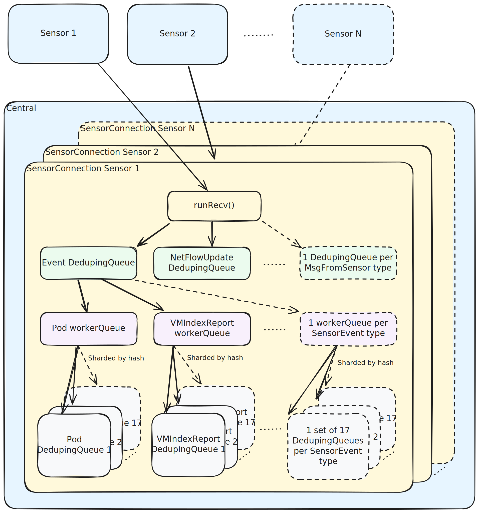

# Sensor-to-Central Message Flow



## Overview

Central receives events from N Sensor clusters concurrently. Each cluster gets a fully
isolated set of queues and workers, so a slow or misbehaving cluster cannot stall others.
Within a cluster, messages are routed through two levels of queuing before reaching a
pipeline fragment that performs validation, enrichment, and datastore writes.

## Architecture

### Layer 1 — gRPC stream (one per cluster)

[`central/sensor/service/service_impl.go`](../service_impl.go) `Communicate()` accepts the
bidirectional gRPC stream opened by Sensor.
[`connection/manager_impl.go`](manager_impl.go) `HandleConnection()` wraps it in a
`sensorConnection` struct that owns all state for that cluster.

`runRecv()` in [`connection_impl.go`](connection_impl.go) is the read loop: it pulls
`MsgFromSensor` off the gRPC stream and forwards each message into the first queue.

### Layer 2 — Per-message-type DedupingQueue

`multiplexedPush()` in [`connection_impl.go`](connection_impl.go) routes every incoming
message into a `DedupingQueue` keyed by `MsgFromSensor` type. There are ~16 distinct
message types (Event, NetworkFlowUpdate, ClusterHealthInfo, ComplianceResponse, …). Queues
are allocated lazily on first use; a dedicated goroutine drains each one via
`handleMessages()`.

The per-type fan-out is primarily about **category isolation**: a surge of one message type
(e.g. `Event` during initial cluster sync) cannot stall processing of another (e.g.
`NetworkFlowUpdate`). These queues use `DedupingQueue`, so messages carrying a `DedupeKey`
are collapsed (see [Deduplication](#deduplication) for which messages set this key and when).

**Gotcha:** only `Event` messages continue into further queuing (Layers 3–4). All other
types (NetworkFlow, Compliance, Telemetry, …) are handled inline in `handleMessage()`
without further queuing.

### Layer 3 — Per-resource-type workerQueue (Events only)

[`sensorevents.go`](sensorevents.go) `addMultiplexed()` receives a decoded `SensorEvent`
and routes it to a `workerQueue` keyed by resource type (Deployment, Pod, Node, …). Up to
~30 workerQueues per `sensorConnection`, allocated lazily.

Before pushing, the content-hash deduper (`deduper.ShouldProcess()`) decides whether this
event carries new information or can be dropped as a duplicate (see
[Content-hash deduplication](#content-hash-deduplication-layer-3)).

### Layer 4 — Sharded DedupingQueues inside each workerQueue

Each `workerQueue` contains **17** internal `DedupingQueue` slots and 17 goroutines — one
per slot. Slot 0 handles messages with no `HashKey`; slots 1–16 are sharded by
`FNV32(HashKey) % 16 + 1`. Because all messages for the same entity (same ID) always land
in the same slot, processing is serialized per entity without a global lock.

This design solves two problems at once: different entities are processed **in parallel**
across slots, while updates to the **same** entity are **serialized** within one slot
(preventing lost-update races in the pipeline). As with Layer 2, these are `DedupingQueue`s,
so messages with a matching `DedupeKey` are collapsed before they reach the pipeline.

**Gotcha (queue count):** the total number of goroutines and queues grows multiplicatively:

```
N clusters × M resource types seen × 17 workers
```

For 10 clusters each sending 15 resource types that is 2 550 goroutines just for workers,
plus Layer-2 queues and their goroutines on top.

**Gotcha (unbounded queues):** the Layer-4 `DedupingQueue` slots have no capacity cap.
Items flow through Layers 2 and 3 quickly (dispatch only), but sit in Layer 4 until a
worker goroutine runs the pipeline fragment — which involves DB writes and can be slow. If
events arrive faster than the pipeline can process them, the queues grow without limit and
will eventually cause an OOM. Replace-in-place dedup provides partial relief for messages
that carry a `DedupeKey`, but messages with an empty key are always appended.

### Layer 5 — Pipeline fragments

[`central/sensor/service/pipeline/all/pipeline.go`](../pipeline/all/pipeline.go) `Run()`
finds the fragment matching the resource type and runs it. Each fragment handles
validation, enrichment, and datastore writes. For deployments this includes SAC checks,
risk scoring, network baseline updates, and policy re-evaluation.

## Deduplication

Two independent deduplication mechanisms operate on the message flow. Both are optional and
apply to different subsets of messages.

### DedupingQueue replace-in-place semantics

[`pkg/dedupingqueue/deduping_queue.go`](../../../../pkg/dedupingqueue/deduping_queue.go)
is used at both Layer 2 and Layer 4. When a message is pushed with a non-empty `DedupeKey`
that matches an already-queued item, the queue **replaces the old item in-place** (the new
item takes the old item's queue position). This means only the latest state of an entity is
ever processed — intermediate updates are silently dropped.

When `DedupeKey` is empty (the zero value), the queue behaves as a plain FIFO — every push
appends without deduplication.

#### Which messages carry a DedupeKey

For the vast majority of traffic — regular Sensor Events arriving from the gRPC stream — no
`DedupeKey` is set when messages enter Layer 2, so those queues behave as plain FIFOs.
The `DedupeKey` is assigned later, in `handleMessage()`, via `shallDedupe()`, which means it
only takes effect at Layer 4. The rules are:

- **No dedup** (key = empty): `CREATE` actions; and for non-`REMOVE` actions:
  `NodeInventory`, `IndexReport`, `VirtualMachine`, `VirtualMachineIndexReport`.
- **Dedup on entity ID**: `UPDATE` and `REMOVE` actions for all other resource types
  (Pod, Deployment, Namespace, etc.).

`shallDedupe()` in [`connection_impl.go`](connection_impl.go) controls this logic.

Two special cases carry a `DedupeKey` **before** reaching Layer 2, so deduplication occurs
at both layers:

- **`AuditLogStatusInfo`** — Sensor sets `DedupeKey = clusterID` before sending
  (`sensor/common/compliance/auditlog_manager_impl.go`). Multiple audit-log state
  snapshots queued before the goroutine drains them collapse to the latest, avoiding
  redundant syncs.
- **`ReprocessDeployment`** — Central's reprocessor (`central/reprocessor/reprocessor.go`)
  injects synthetic Event messages with `DedupeKey = UUIDv5(riskDedupeNamespace,
  deploymentID)`. Because the reprocessor also sets `HashKey` and the message type is
  `ReprocessDeployment`, `handleMessage()` short-circuits before `shallDedupe()`,
  preserving the key through both layers. This collapses redundant risk-reprocessing
  requests for the same deployment.

All other non-Event message types (`NetworkFlowUpdate`, `ComplianceResponse`,
`TelemetryDataResponse`, …) carry no `DedupeKey` and are therefore never deduplicated.

### Content-hash deduplication (Layer 3)

Before an Event enters a `workerQueue`, `deduper.ShouldProcess()`
([`central/hash/manager/deduper.go`](../../../hash/manager/deduper.go)) checks the
content hash of the event. The hash is normally **computed by Sensor** and sent as
`SensorHash`; Central only computes it as a backward-compatibility fallback when
`SensorHashOneof` is nil. If the same entity was already processed with an identical hash,
the message is dropped.

This deduplication state is periodically flushed to the `hashes` postgres table and
reloaded on Central restart, so it can survive restarts. However, persistence is
**conditional**: when the `ROX_HASH_FLUSH_INTERVAL` environment variable is set to `0`,
Central truncates the `hashes` table on startup and does not flush — effectively disabling
cross-restart deduplication.

## Key Code Locations

- [central/sensor/service/service_impl.go](../service_impl.go) — gRPC entry point `Communicate():88`
- [central/sensor/service/connection/connection_impl.go](connection_impl.go) — `sensorConnection` struct; `multiplexedPush():171`; `handleMessage():342`; `shallDedupe()`
- [central/sensor/service/connection/sensorevents.go](sensorevents.go) — Layer-3 queue dispatch `addMultiplexed():80`
- [central/sensor/service/connection/worker_queue.go](worker_queue.go) — 17-slot sharded queue; FNV hashing `indexFromKey():51`
- [central/hash/manager/deduper.go](../../../hash/manager/deduper.go) — content-hash deduplication `ShouldProcess()`
- [pkg/dedupingqueue/deduping_queue.go](../../../../pkg/dedupingqueue/deduping_queue.go) — replace-in-place queue semantics
- [central/sensor/service/pipeline/all/pipeline.go](../pipeline/all/pipeline.go) — pipeline fragment dispatch `Run():64`
