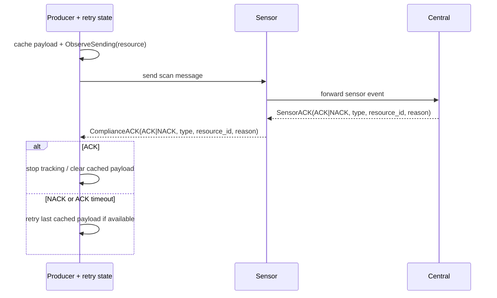
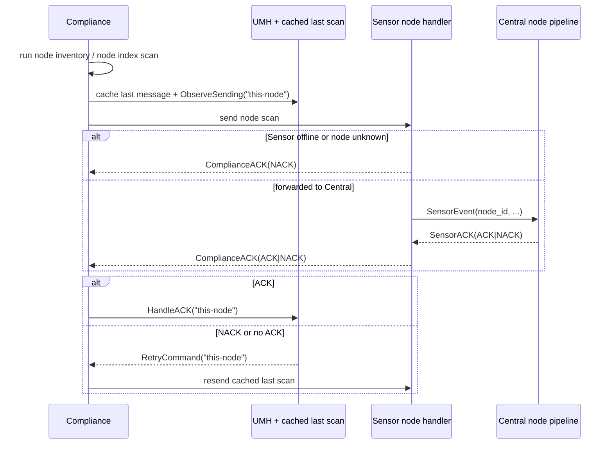
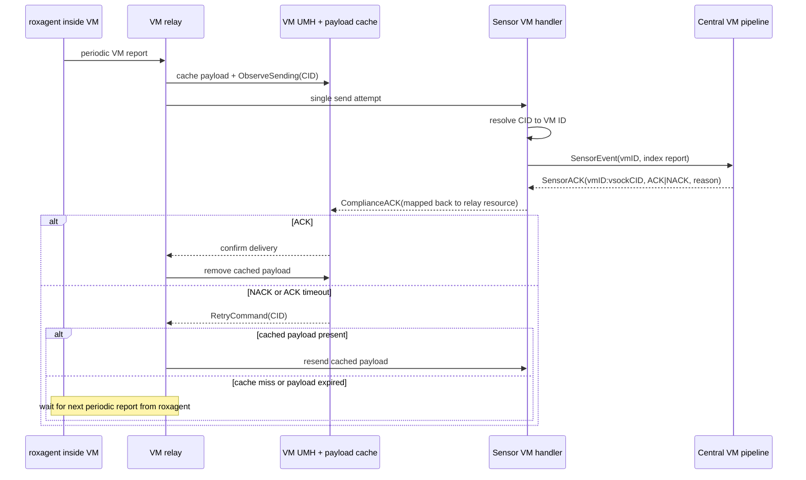

# ACK Model for Node and VM Scanning in ACS

This document describes the ACK model ACS uses for node scanning and is extending to VM scanning for 4.11.
It treats the 4.11 behavior as the reference design, then calls out the small VM-specific gap that is still being closed in [#20118](https://github.com/stackrox/stackrox/pull/20118) and [#20107](https://github.com/stackrox/stackrox/pull/20107).

## Summary for Busy Readers

- ACS uses a generic ACK model:
  - `SensorACK` for `Central -> Sensor`
  - `ComplianceACK` for `Sensor -> Compliance`
- ACKs were introduced for node scanning so Compliance could retry expensive periodic node scans instead of waiting for the next normal interval when only delivery had failed.
- For 4.11, VM scanning follows the same delivery-tracking idea: the relay sends once, a VM-specific UMH tracks ACK/NACK, and the last payload can be retransmitted while it remains cached.
- VM ACK correlation uses `vmID:vsockCID`, which avoids CID reuse ambiguity while still matching the relay's CID-based state.
- Even in this design, ACS still cannot tell `roxagent` to run a fresh guest-side scan on demand. It can only retransmit the last cached report while that payload is still available.

## Design Overview

The core idea is simple: producing a scan and confirming its delivery are treated as separate steps. The producer keeps just enough state to retry delivery when delivery fails, without requiring a new scan when the data itself is still valid.

At a high level, ACK handling looks like this:



A few compatibility constraints still shape the design:

- Generic `SensorACK` sending is capability-gated through `SensorACKSupport`.
- Node scanning still has a legacy compatibility path because older Central versions used `NodeInventoryACK` instead of `SensorACK`.

One semantic detail also matters:

- ACK means "do not retry this message anymore". Most of the time that is because the message was processed successfully, but ACK can also be used intentionally when retrying would only create noise, for example when a feature is disabled.

## Why ACKs Were Introduced

ACKs first mattered for node scanning.

Node scans are periodic and relatively expensive. Without ACKs, Compliance had no good way to know whether the last generated scan had actually made it through Sensor and Central. A temporary problem such as:

- Sensor being offline
- Central being unreachable
- the node not yet being known to Sensor
- Central failing while processing the scan

could otherwise force Compliance to wait until the next normal scan interval before trying again.

So the ACK design added three things:

- cache the last scan message
- track it as unconfirmed
- retry it on NACK or on missing ACK

## Node Scanning

Node scanning is the original model, and it already behaves this way.

Compliance uses a single local resource key, `this-node`, because one Compliance instance handles exactly one node.



This is the baseline that the VM flow is meant to follow.

## VM Scanning

VM scanning reuses the same ACK model, but the producer is different.

The report originates inside the guest VM in `roxagent`, is sent over vsock to the host, passes through the relay running in the Compliance container, then goes through Sensor and Central.

In the 4.11 design:

- the relay hands the report off once instead of doing long blocking inline retries
- a VM-specific UMH tracks whether delivery has been confirmed
- the relay keeps the last payload in a bounded cache
- on retry, that cached payload can be retransmitted immediately



The design also adds two host-side controls:

- per-VSOCK rate limiting, so one noisy VM cannot monopolize the host relay path
- stale-ACK detection, so the system can distinguish ordinary back-pressure from "we have not seen an ACK for too long"

## Why the VM `resource_id` Uses `vmID:vsockCID`

For node scanning, the resource ID can simply be the node name because the sender and retry owner are both node-local.

VM scanning needs more than that.

Using only the vsock CID is unsafe because a CID can later be reused by a different VM. Using only the VM ID is also not ideal because the relay naturally knows the report by CID.

So the intended correlation key is:

```text
vmID:vsockCID
```

This gives both sides what they need:

- `vmID` avoids cross-VM ambiguity if a CID is reused
- `vsockCID` preserves the relay-visible identifier
- Sensor can still extract the VM ID portion to route the ACK back toward the right host-side connection

One limitation remains: `vmID:vsockCID` is still not a per-report unique ID. Multiple in-flight reports from the same VM with the same CID are still not fully distinguishable.

## What This Still Does Not Change

Even in the 4.11 design, ACS still cannot tell `roxagent` to perform a fresh scan on demand.

So the improvement is limited to delivery retry:

- ACS can retransmit the last known VM report while it is cached.

But ACS still cannot:

- trigger a brand new guest-side rescan immediately after a NACK.

## Status Note

The document above is ahead of the current implementation only in the VM-specific retry pieces.

What already matches this design:

- the generic ACK message types
- the node ACK/retry loop
- the VM ACK correlation direction using `vmID:vsockCID`

What is still landing:

- [#20118](https://github.com/stackrox/stackrox/pull/20118): connect VM ACK/NACK handling to the VM-specific retry state and move the relay away from long inline retry behavior
- [#20107](https://github.com/stackrox/stackrox/pull/20107): add the relay payload cache so the retry path can retransmit the last report instead of only waiting for the next periodic submission
