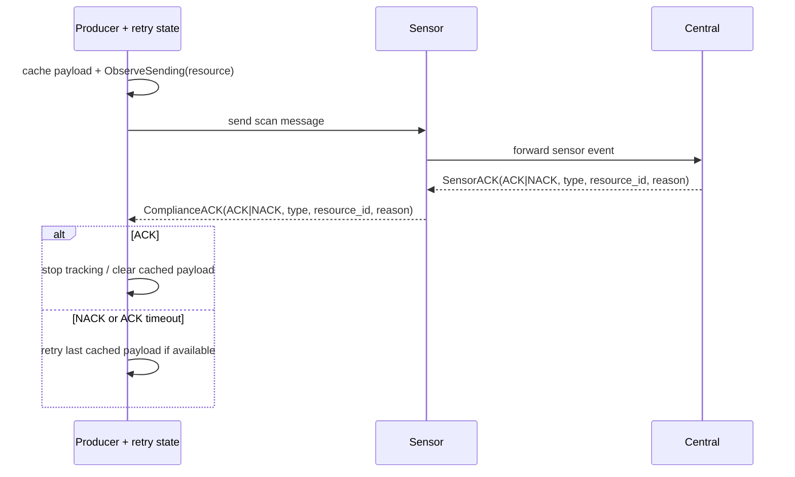
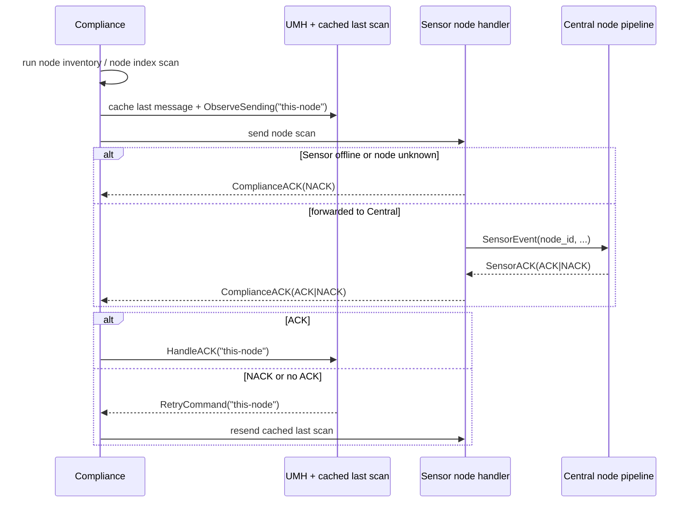

# ACK Model for Node Scanning in ACS

This document describes the ACK model ACS uses for node scanning.

For the VM index report ACK/retry design, see `sensor/common/virtualmachine/ACK_MODEL.md`.

## Summary for Busy Readers

- ACS uses a generic ACK model:
  - `SensorACK` for `Central -> Sensor`
  - `ComplianceACK` for `Sensor -> Compliance`
- ACKs were introduced for node scanning so Compliance could retry expensive periodic node scans instead of waiting for the next normal interval when only delivery had failed.

## Design Overview

The core idea is simple: producing a scan and confirming its delivery are treated as separate steps. The producer keeps just enough state to retry delivery when delivery fails, without requiring a new scan when the data itself is still valid.

At a high level, ACK handling looks like this:

```mermaid
sequenceDiagram
    participant P as Producer + retry state
    participant S as Sensor
    participant X as Central

    P->>P: cache payload + ObserveSending(resource)
    P->>S: send scan message
    S->>X: forward sensor event
    X-->>S: SensorACK(ACK|NACK, type, resource_id, reason)
    S-->>P: ComplianceACK(ACK|NACK, type, resource_id, reason)

    alt ACK
        P->>P: stop tracking / clear cached payload
    else NACK or ACK timeout
        P->>P: retry last cached payload if available
    end
```

A few compatibility constraints still shape the design:

- Generic `SensorACK` sending is capability-gated through `SensorACKSupport`.
- Node scanning still has a legacy compatibility path because older Central versions used `NodeInventoryACK` instead of `SensorACK`.

One semantic detail also matters:

- ACK means "do not retry this message anymore". Most of the time that is because the message was processed successfully, but ACK can also be used intentionally when retrying would only create noise, for example when a feature is disabled.

## Why ACKs Were Introduced

ACKs first mattered for node scanning.

Node scans are periodic and relatively expensive. Without ACKs, Compliance had no good way to know whether the last generated scan had actually made it through Sensor and Central. A temporary problem such as:

- Sensor being offline
- Central being unreachable
- the node not yet being known to Sensor
- Central failing while processing the scan

could otherwise force Compliance to wait until the next normal scan interval before trying again.

So the ACK design added three things:

- cache the last scan message
- track it as unconfirmed
- retry it on NACK or on missing ACK

## Node Scanning

Node scanning is the original model, and it already behaves this way.

Compliance uses a single local resource key, `this-node`, because one Compliance instance handles exactly one node.

```mermaid
sequenceDiagram
    participant C as Compliance
    participant U as UMH + cached last scan
    participant S as Sensor node handler
    participant X as Central node pipeline

    C->>C: run node inventory / node index scan
    C->>U: cache last message + ObserveSending("this-node")
    C->>S: send node scan

    alt Sensor offline or node unknown
        S-->>C: ComplianceACK(NACK)
    else forwarded to Central
        S->>X: SensorEvent(node_id, ...)
        X-->>S: SensorACK(ACK|NACK)
        S-->>C: ComplianceACK(ACK|NACK)
    end

    alt ACK
        C->>U: HandleACK("this-node")
    else NACK or no ACK
        U-->>C: RetryCommand("this-node")
        C->>S: resend cached last scan
    end
```
