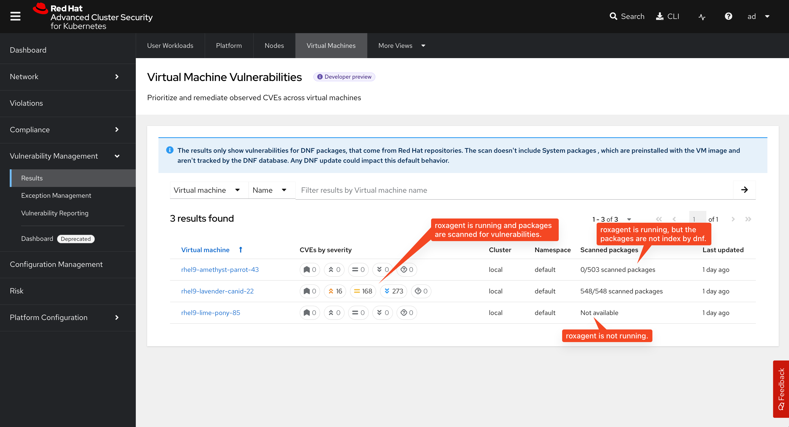

# Virtual machine vulnerability management

Virtual machine vulnerability management enables Red Hat Advanced Cluster Security for Kubernetes (RHACS) to scan virtual machines running on OpenShift Virtualization for installed packages and vulnerabilities. This feature extends RHACS security capabilities beyond containers to include virtual machine workloads.

> **Important**
>
> This feature is currently in developer preview. Developer preview features are not supported with Red Hat production service level agreements (SLAs) and might not be functionally complete. Red Hat does not recommend using them in production.

## About virtual machine vulnerability scanning

The virtual machine vulnerability scanning feature identifies security vulnerabilities in packages installed within virtual machines. The system creates index reports of installed packages and matches them against known vulnerabilities to provide comprehensive security assessment of virtual machine workloads.

Virtual machine vulnerability management uses the following architecture to collect, process, and analyze virtual machine package data:

* **`roxagent`**: A binary executable that runs inside virtual machines to scan for installed packages and creates index reports.
* **relay**: A component in the collector daemonset that receives index reports from `roxagent` and forwards them to Sensor.
* **Sensor**: The cluster-level RHACS component that collects data from relay components and sends it to Central.
* **Central**: The main RHACS platform that stores virtual machine information and runs vulnerability enrichment.

## Data flow for virtual machine scanning

The virtual machine vulnerability scanning process follows this data flow:

1. The `roxagent` binary running inside a virtual machine scans the filesystem for installed packages (rpm/dnf databases).
2. `roxagent` creates index reports based on discovered packages.
3. `roxagent` sends the index reports to the host via vsock protocol.
4. The relay component in the collector daemonset receives the index reports.
5. relay forwards the reports to Sensor for processing.
6. Sensor aggregates virtual machine data with Kubernetes API information.
7. Sensor sends the combined data to Central.
8. Central stores the virtual machine information and runs vulnerability enrichment to match packages with known CVEs.
9. Central provides UI and API access to virtual machine vulnerability data.

## Prerequisites for virtual machine vulnerability management

Before you can use virtual machine vulnerability management, you must meet the following prerequisites:

### Feature flag requirements

The virtual machine feature requires the `ROX_VIRTUAL_MACHINES=true` environment variable on the following components:

* Central deployment
* Sensor deployment
* Compliance container in the collector daemonset

### OpenShift Virtualization requirements

* OpenShift Virtualization operator must be installed in the cluster.
* The HyperConverged resource must be patched to enable VSOCK support.

### Virtual machine requirements

* Virtual machine resources must include VSOCK support by setting `spec.domain.devices.autoattachVSOCK: true`.
* Virtual machines must run Red Hat Enterprise Linux (RHEL).
* RHEL systems must be activated with a valid subscription.
* Virtual machines must have network access to download repository-to-CPE mappings.

### Infrastructure requirements

* Metal nodes are recommended to host virtual machines for optimal performance.

## Current limitations

Virtual machine vulnerability management has the following limitations:

### Operating system support

* *RHEL only*: Currently supports Red Hat Enterprise Linux virtual machines only.
* *Valid subscription*: RHEL systems must be activated with a valid subscription.
* *Repository access*: Only RHEL packages indexed by dnf with valid repository links are scannable.

### Package scanning constraints

* Requires `sudo` privileges for `roxagent` to scan package databases.
* Only packages managed by rpm/dnf are detected.
* Network connectivity required for repository-to-CPE mapping downloads.

## Configuring virtual machine vulnerability management

You can configure virtual machine vulnerability management by setting environment variables and configuring the `roxagent` binary.

### Environment variables

You can configure the following environment variables for the virtual machine feature:

- `ROX_VIRTUAL_MACHINES_VSOCK_PORT`: Port for vsock connections. Default: 818.
- `ROX_VIRTUAL_MACHINES_VSOCK_CONN_MAX_SIZE_KB`: Maximum connection size in KB. Default: 4096.

### `roxagent` configuration options

The `roxagent` binary supports the following configuration options:

- `--daemon`: Run continuously. Default: false.
- `--index-interval`: Time between scans in daemon mode. Default: 5m.
- `--host-path`: Package database location. Default: /.
- `--port`: VSock port. Default: 1024.
- `--repo-cpe-url`: URL for repository to CPE mapping.
- `--timeout`: VSock client timeout for sending reports.
- `--verbose`: Print index reports to stdout.

## Enabling virtual machine vulnerability management

To enable virtual machine vulnerability management, you must configure the feature flag, enable VSOCK support, and deploy the `roxagent` binary.

### Enabling the feature flag

1. Configure Central with the feature flag:

   ```yaml
   env:
     - name: ROX_VIRTUAL_MACHINES
       value: "true"
   ```

2. Configure Sensor with the feature flag:

   ```yaml
   env:
     - name: ROX_VIRTUAL_MACHINES
       value: "true"
   ```

3. Configure the compliance container in the collector daemonset:

   ```yaml
   env:
     - name: ROX_VIRTUAL_MACHINES
       value: "true"
   ```

### Enabling VSOCK support in OpenShift Virtualization

1. Patch the HyperConverged resource to enable VSOCK support:

   ```bash
   kubectl patch hyperconverged kubevirt-hyperconverged -n openshift-cnv --type='merge' --patch='{"spec":{"configuration":{"developerConfiguration":{"featureGates":["VSOCK"]}}}}'
   ```

2. Alternatively, you can use the annotation method:

   ```yaml
   metadata:
     annotations:
       kubevirt.kubevirt.io/jsonpatch: |-
         [
           {
             "op":"add",
             "path":"/spec/configuration/developerConfiguration/featureGates/-",
             "value":"VSOCK"
           }
         ]
   ```

### Configuring virtual machines for vulnerability scanning

1. Configure virtual machine resources to include VSOCK support:

   ```yaml
   apiVersion: kubevirt.io/v1
   kind: VirtualMachine
   spec:
     template:
       spec:
         domain:
           devices:
             autoattachVSOCK: true
   ```

### Deploying `roxagent`

1. Download `roxagent` from `https://mirror.openshift.com/pub/rhacs/assets/4.9.0/bin/linux/roxagent`.

2. Alternatively, build the `roxagent` binary for the target virtual machine:

   ```bash
   git clone git@github.com:stackrox/stackrox.git
   cd stackrox
   GOOS=linux GOARCH=amd64 go build ./compliance/virtualmachines/roxagent
   ```

3. Transfer the binary to the virtual machine using your preferred method, such as scp or cloud-init.

4. Run the binary inside the virtual machine:

   ```bash
   # One-time scan
   sudo ./roxagent

   # Continuous monitoring
   sudo ./roxagent --daemon
   ```

## Using virtual machine vulnerability management

Navigate to **Vulnerability Management** -> **Results** -> **Virtual Machines**. The table displays all virtual machines including their vulnerabilities. The **Scanned packages** column indicates whether `roxagent` is running, and whether the packages have been indexed correctly.



## Troubleshooting virtual machine vulnerability management

This section provides solutions for common issues you might encounter when using virtual machine vulnerability management.

### Connection issues

*Problem*: `roxagent` cannot connect to host

*Solution*: Try the following troubleshooting steps:

* Verify VSOCK is enabled in the virtual machine configuration.
* Check that the relay is running on the host node.
* Ensure vsock kernel modules are loaded.
* Verify port configuration matches between `roxagent` and relay.

*Problem*: No packages found

*Solution*: Try the following troubleshooting steps:

* Check that `--host-path` points to the correct filesystem location.
* Verify rpm/dnf databases exist and are readable by `roxagent`.
* Use the `--verbose` flag to examine index reports.
* Confirm that the `roxagent` has sudo privileges.

### Scanning issues

*Problem*: Vulnerability data not appearing in RHACS

*Solution*: Try the following troubleshooting steps:

* Verify the feature flag is enabled on all components.
* Check Central logs for enrichment processing.
* Ensure the virtual machine has a valid RHEL subscription.
* Confirm repository-to-CPE mapping downloads are successful.

*Problem*: Network connectivity problems

*Solution*: Try the following troubleshooting steps:

* Verify the virtual machine has internet access or connectivity to Sensor.
* Check firewall rules for repository access.
* Validate DNS resolution from within the virtual machine.

### Performance issues

*Problem*: Large memory usage

*Solution*: Try the following troubleshooting steps:

* Adjust `ROX_VIRTUAL_MACHINES_VSOCK_CONN_MAX_SIZE_KB` if needed.
* Monitor relay resource consumption.
* Consider reducing scan frequency in daemon mode.

*Problem*: Slow scan times

*Solution*: Try the following troubleshooting steps:

* Verify metal nodes are used for virtual machine hosting.
* Check network latency for repository downloads.
* Monitor disk I/O during package database reads.
