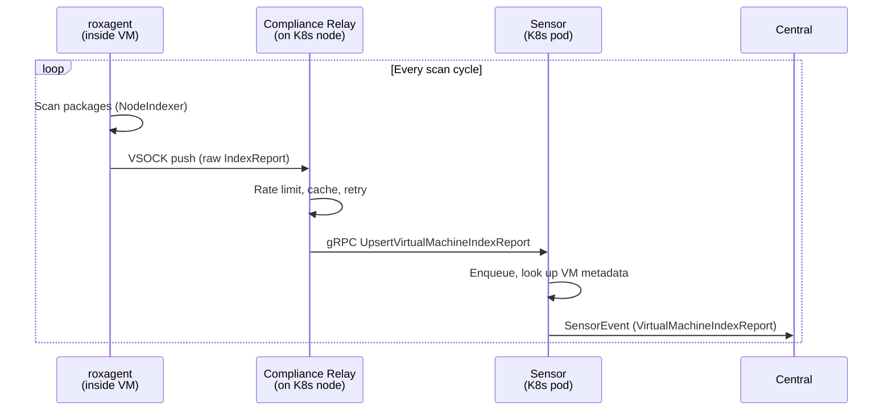
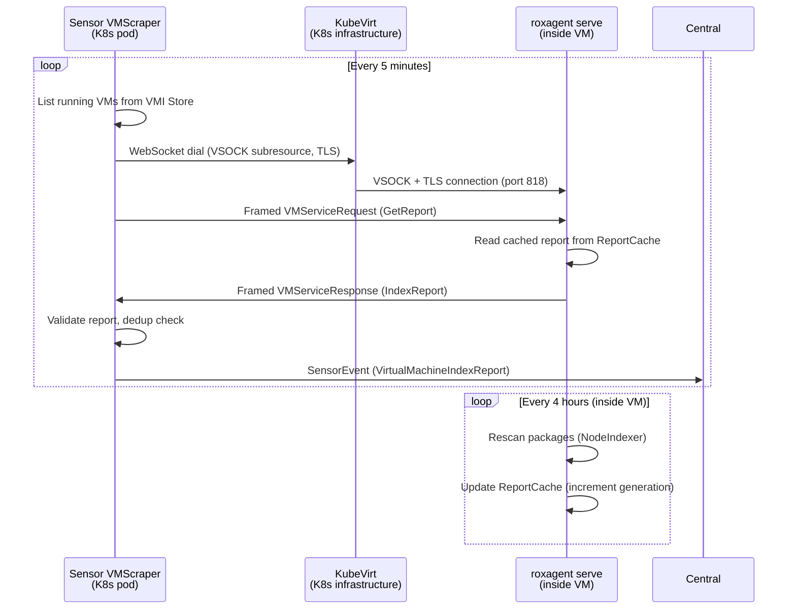
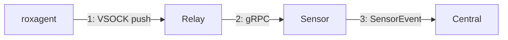
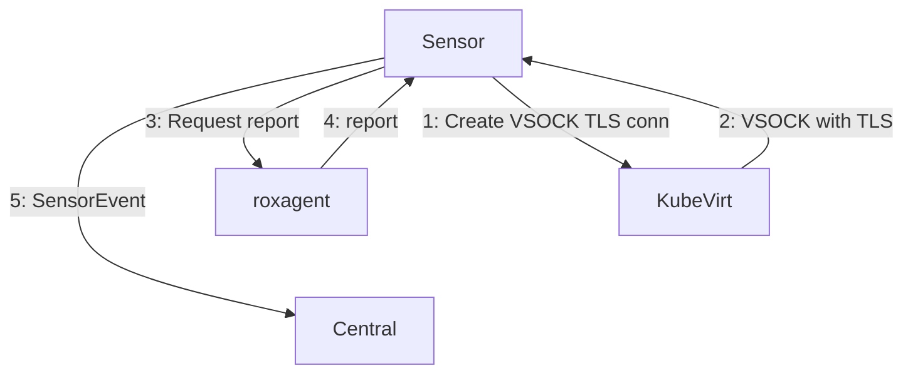
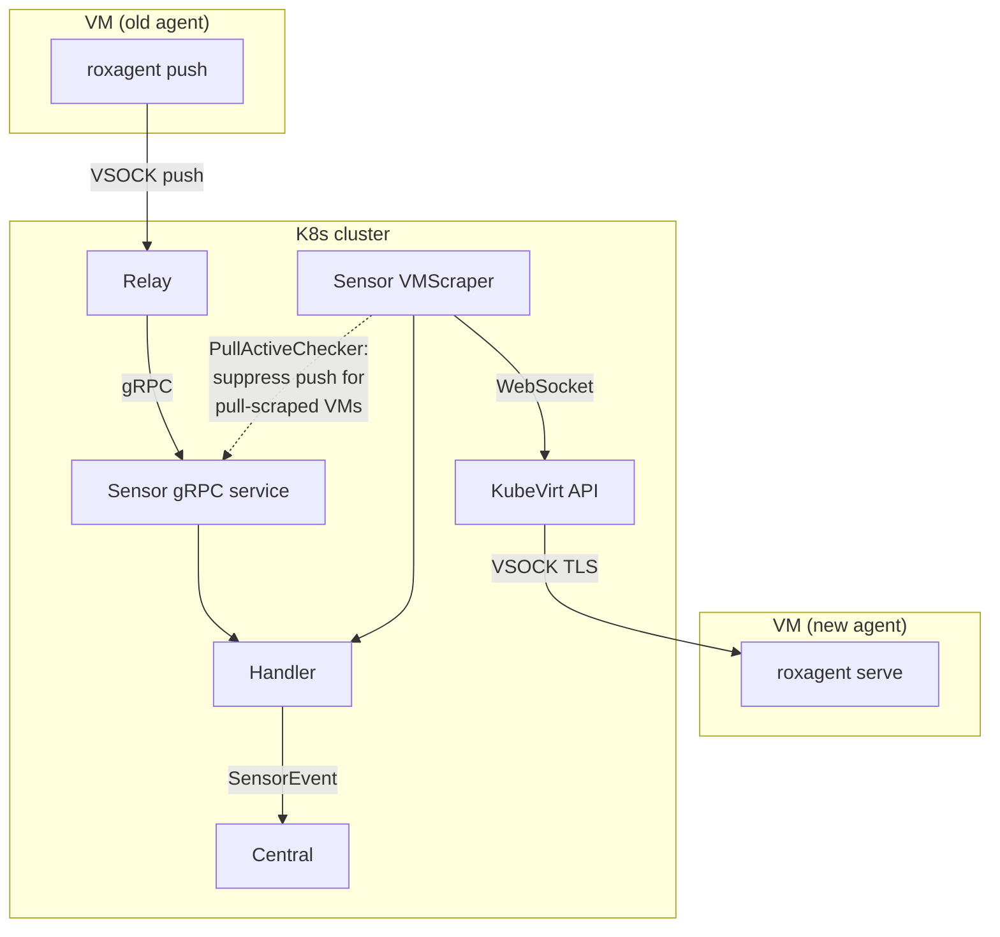

# VSOCK Pull Mode — 1. Architecture: Push vs Pull

**Parent design:** [Production Design v2](2026-06-23-vsock-pull-mode-production-design.md)  
**Next:** [2. Protocol](2026-06-23-vsock-pull-mode-2-protocol.md)  
**Audience:** PR reviewers — start here for the big picture

---

## Why the change?

The push model breaks when Linux kernel VSOCK namespace isolation is enabled —
VMs can no longer reach the relay across namespace boundaries. Pull mode reverses
the data flow: Sensor connects into the VM instead of the VM pushing outward.

---

## Push Mode (current, being replaced)

**Components involved:**

| Component | Role | Runs on |
|-----------|------|---------|
| **roxagent** | Scans VM packages, pushes report over VSOCK | Inside each VM |
| **Compliance Relay** | Listens on VSOCK, rate-limits, retries toward Sensor | K8s node (DaemonSet) |
| **Sensor gRPC service** | Receives reports, enriches with VM metadata | K8s pod |
| **Central** | Stores and processes reports | K8s pod |

**Data flow direction:** VM → outward (roxagent initiates)

---

## Pull Mode (new)

> **KubeVirt internals (for reference, not our code):**
> Sensor's WebSocket request hits **virt-api** (a K8s service), which routes it to
> the **virt-handler** DaemonSet on the node hosting the VM. virt-handler opens the
> VSOCK connection to the VM and wraps it in TLS (acting as TLS client, presenting
> a cert signed by the KubeVirt CA). From our perspective this is a transparent
> WebSocket-to-VSOCK bridge — we dial a K8s API endpoint and get a byte stream
> connected to the VM.

**Components involved:**

| Component | Role | Runs on |
|-----------|------|---------|
| **roxagent `serve`** | Scans packages, caches report, serves over VSOCK | Inside each VM |
| **Sensor VMScraper** | Polls VMs, dials via KubeVirt API, reads reports | K8s pod |
| **KubeVirt (virt-api, virt-handler)** | Routes WebSocket → VSOCK with TLS | K8s infrastructure |
| **Central** | Stores and processes reports (unchanged) | K8s pod |

**Data flow direction:** Sensor → inward (Sensor initiates)

---

## Side-by-side comparison

**Push Mode (old):** roxagent initiates outward

**Pull Mode (new):** Sensor initiates inward

| Aspect | Push | Pull |
|--------|------|------|
| **Who initiates** | roxagent (VM) | Sensor (K8s) |
| **Transport** | Raw VSOCK → Relay → gRPC | WebSocket → KubeVirt → VSOCK (TLS) |
| **Intermediate hop** | Compliance Relay (per node) | None — Sensor dials VM directly via KubeVirt API |
| **Scan trigger** | roxagent timer → push immediately | roxagent rescans on timer; Sensor polls independently |
| **Deduplication** | Relay rate-limits per VSOCK CID | Sensor tracks generation counter per VM |
| **TLS** | None on VSOCK leg | KubeVirt TLS (virt-handler client cert, KubeVirt CA) |
| **Namespace isolation** | Breaks (VM can't reach relay) | Works (Sensor reaches VM via K8s API) |
| **Central interface** | Same `SensorEvent_VirtualMachineIndexReport` | Same `SensorEvent_VirtualMachineIndexReport` |
| **Report format** | Same `scanner.v4.IndexReport` | Same `scanner.v4.IndexReport` |

---

## Transition period

During the transition, both paths coexist:

- **Old agents** still push via Relay → Sensor gRPC service
- **New agents** are pulled by VMScraper via KubeVirt API
- **Push suppression:** when VMScraper successfully scrapes a VM, it registers the VM
  as "actively scraped". The gRPC service drops push reports for those VMs.
- **Central is unchanged** — it receives the same `SensorEvent` regardless of path

The short transition window is for development, release 5.0 will be shipped with pull mode only.
