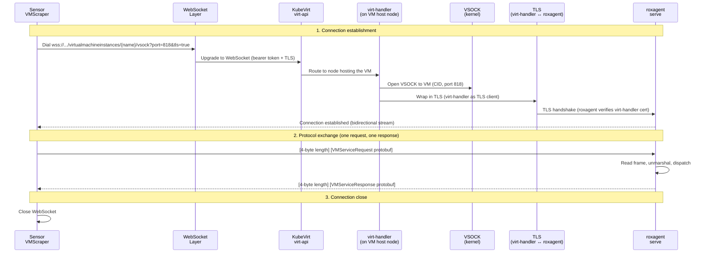
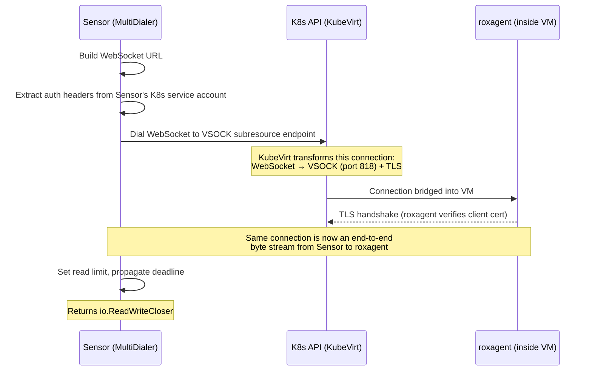
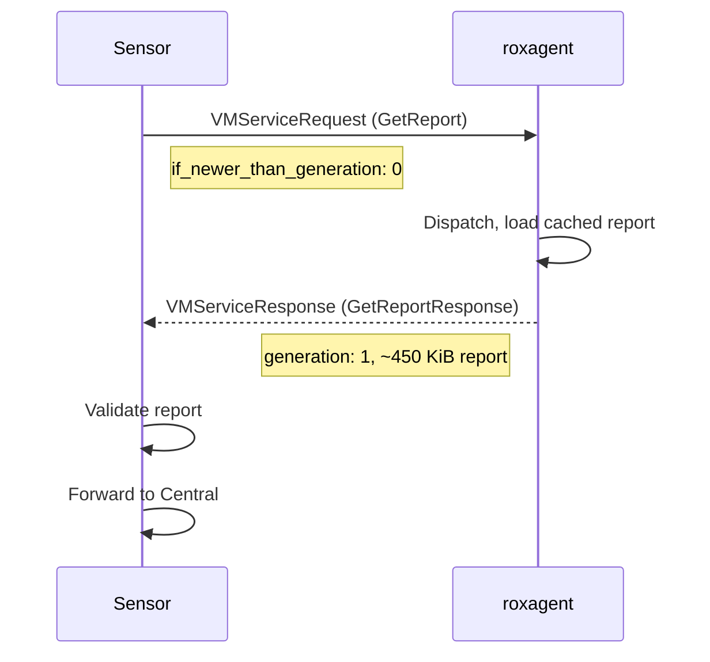
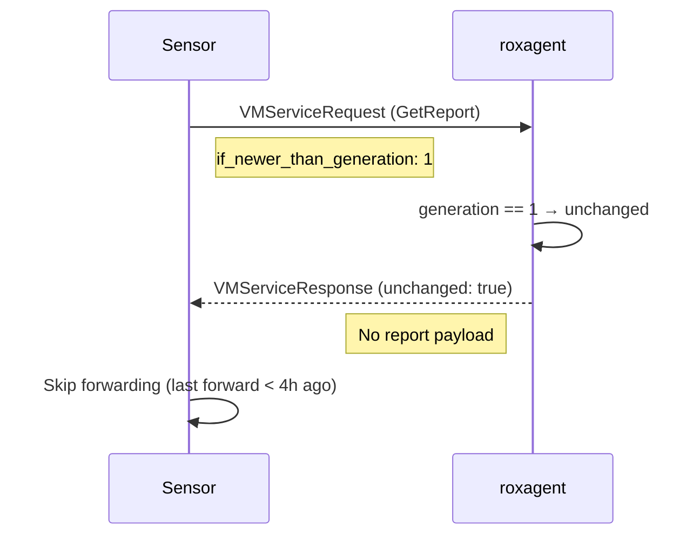
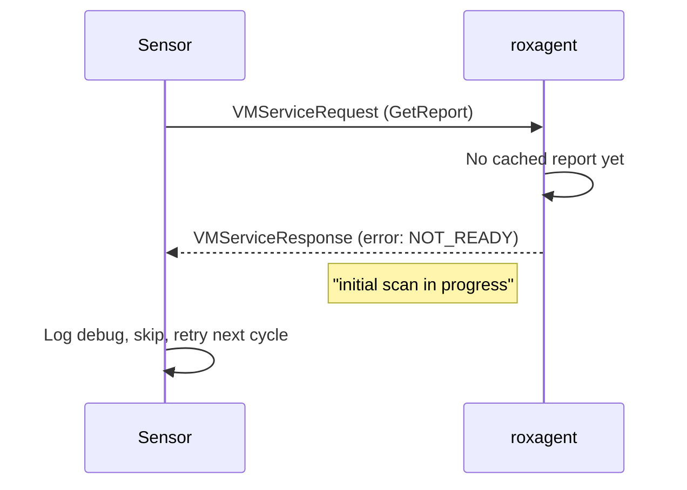

# VSOCK Pull Mode — 2. Communication Protocol

**Parent design:** [Production Design v2](2026-06-23-vsock-pull-mode-production-design.md)  
**Previous:** [1. Architecture](2026-06-23-vsock-pull-mode-1-architecture.md)  
**Next:** [3. Compatibility](2026-06-23-vsock-pull-mode-3-compatibility.md)  
**Audience:** PR reviewers — how data moves between Sensor and roxagent

---

## End-to-end Sensor-Roxagent request lifecycle



---

## Layer stack

Each layer wraps the one below it. Data flows through all layers on every request:

```
┌─────────────────────────────────────────────────────────────┐
│                    Application Layer                        │
│  protobuf: VMServiceRequest  (Sensor → roxagent)            |
|  protobuf: VMServiceResponse (roxagent → Sensor)            │
├─────────────────────────────────────────────────────────────┤
│                    Framing Layer                            │
│  [4 bytes: payload length, big-endian uint32] [payload]     │
│  pkg/vsockframing — shared by Sensor and roxagent           │
├─────────────────────────────────────────────────────────────┤
│                    Transport Layer                          │
│  Byte stream (io.ReadWriteCloser / net.Conn)                │
│  Both sides read/write raw bytes — connection establishment │
│  details (WebSocket, VSOCK bridging) are transparent        │
├─────────────────────────────────────────────────────────────┤
│                    Security Layer                           │
│  TLS 1.2+ — virt-handler wraps VSOCK in TLS as client       │
│  roxagent verifies virt-handler's client cert (KubeVirt CA) │
├─────────────────────────────────────────────────────────────┤
│                    Network Layer                            │
│  VSOCK (AF_VSOCK) — VM ↔ hypervisor, port 818               │
└─────────────────────────────────────────────────────────────┘
```

---

## Connection establishment (Sensor → KubeVirt → VM)

### How Sensor establishes the connection (MultiDialer)



**URL format:** `wss://{api-server}/apis/subresources.kubevirt.io/v1/namespaces/{ns}/virtualmachineinstances/{name}/vsock?port=818&tls=true`

**Auth headers:** extracted from Sensor's REST config (bearer token, client certs, impersonation)

**Why plain WebSocket, not kubevirt client-go?**
`kubevirt.io/client-go` registers a `-v` flag in `init()` that conflicts with glog
(already in Sensor's dependency tree), causing a panic. Bug https://github.com/kubevirt/kubevirt/issues/16951
The dialer reimplements the subresource WebSocket call using only `k8s.io/client-go/rest` + `gorilla/websocket`.

### What KubeVirt does (transparent to our code)

1. **virt-api** receives the WebSocket upgrade, authorizes via RBAC
   (`virtualmachineinstances/vsock` on `subresources.kubevirt.io`)
2. **virt-api** routes to the **virt-handler** running on the node that hosts the VM
3. **virt-handler** opens a VSOCK connection to the VM (CID + port 818)
4. Because `tls=true`, virt-handler wraps the VSOCK stream in TLS (as **client**),
   presenting a cert signed by KubeVirt's internal CA
5. Bidirectional byte stream is bridged: WebSocket ↔ TLS ↔ VSOCK

### What roxagent does (VSOCK listener)

1. Listens on VSOCK port 818 via `vsock.Listen()`
2. Wraps listener with `tls.NewListener()` — **TLS is mandatory** by design of this feature
3. On accept: verifies virt-handler's client cert against KubeVirt CA
4. Enforces max 1 concurrent connection (semaphore); rejects extras
5. Sets 30-second deadline on connection

---

## Framing protocol

Every message between Sensor and roxagent (request and response) is wrapped in a length-prefixed frame:

```
┌──────────────────────┬─────────────────────────────────┐
│ 4 bytes              │ N bytes                         │
│ big-endian uint32    │ protobuf-encoded message        │
│ (payload length = N) │ (VMServiceRequest or Response)  │
└──────────────────────┴─────────────────────────────────┘
```

- **Sender** (`WriteFrame`): writes 4-byte length, then payload
- **Receiver** (`ReadFrame`): reads 4-byte length, rejects if `> maxSize`, reads payload
- **Max sizes:**
  - Agent reads requests: 1 MiB (typical request is ~100 bytes — UUID + capability string)
  - Sensor reads responses: 16 MiB (configurable, `ROX_VIRTUAL_MACHINES_PULL_MAX_RESPONSE_SIZE_KB`).
    Typical RHEL 9/10 report: ~450 KiB, ~524 packages.

---

## Request/response protocol

One request, one response, then the connection closes. No keep-alive or pipelining.

### Sensor sends: VMServiceRequest

```protobuf
message VMServiceRequest {
  RequestMeta meta = 1;
  oneof method {
    GetReportRequest get_report = 2;
  }
}

message RequestMeta {
  string request_id = 1;
  repeated string capabilities = 2;
  map<string, string> facts = 3;
}

message GetReportRequest {
  uint32 if_newer_than_generation = 1;
}
```

**Field descriptions:**

- **`request_id`** (UUID): Correlation ID for tracing and log matching. Each request
  gets a unique ID so that Sensor and agent logs can be correlated for debugging.
- **`capabilities`**: List of features this Sensor understands (currently `["report_v1"]`).
  The agent can inspect this to decide which response format to use. Designed for
  future extensibility — new capabilities can be added without protocol version bumps.
- **`facts`**: Arbitrary key-value metadata from Sensor. Currently empty (`{}`), reserved
  for future use (e.g., passing Sensor version or cluster context to the agent).
- **`if_newer_than_generation`**: Sensor sends the last known generation for this VM.
  Agent compares using strict equality (`==`, not `>=`) — if equal, responds `unchanged`.
  Value `0` means "always send the full report".

**Example request:**

```json
{
  "meta": {
    "request_id": "a3f1b2c4-5d6e-7f80-9a1b-2c3d4e5f6a7b",
    "capabilities": ["report_v1"],
    "facts": {
      "sensor_version": "4.7.0",
      "cluster_id": "c8d9e0f1-2a3b-4c5d-6e7f-8a9b0c1d2e3f"
    }
  },
  "get_report": {
    "if_newer_than_generation": 3
  }
}
```

> **Note:** `facts` is currently sent empty in the implementation. The example above
> shows how it could be used in the future to pass contextual metadata to the agent.

### roxagent responds: VMServiceResponse

```protobuf
message VMServiceResponse {
  ResponseMeta meta = 1;
  oneof result {
    GetReportResponse get_report = 2;
    ErrorResponse error = 3;
  }
}

message ResponseMeta {
  string agent_version = 1;
  google.protobuf.Timestamp report_generated_at = 2;
  uint32 report_generation = 3;
  repeated string supported_methods = 4;
  map<string, string> facts = 5;
}

message GetReportResponse {
  scanner.v4.IndexReport index_report = 1;
  bool unchanged = 2;
}

message ErrorResponse {
  ErrorCode code = 1;
  string message = 2;
  map<string, string> details = 3;
}
```

**Field descriptions:**

- **`agent_version`**: roxagent build version (e.g. `"4.7.0-12-gabcdef"`), injected via
  ldflags at build time. Useful for debugging version mismatches.
- **`report_generated_at`**: Timestamp of when the cached report was produced by the
  scanner. Lets Sensor know how fresh the data is.
- **`report_generation`**: Monotonic counter incremented on each rescan. Sensor uses
  this for deduplication — if the generation hasn't changed, the report is the same.
  Resets to 1 on agent restart.
- **`supported_methods`**: List of request methods this agent accepts (currently
  `["get_report"]`). Sensor can check this before sending new method types in the future.
- **`facts`**: VM metadata discovered during each scan — `detected_os`, `os_version`,
  `activation_status`, `dnf_metadata_status`. Used by Sensor for logging and metrics.
- **`index_report`**: The full scan report (`scanner.v4.IndexReport`) containing
  discovered packages and their metadata. Set when the report is new or forced.
- **`unchanged`**: `true` when the agent's generation matches the requested
  `if_newer_than_generation`. In this case `index_report` is nil (nothing to send).
- **`error`**: Returned instead of `get_report` when something went wrong. Error codes:
  `NOT_READY` (initial scan still in progress), `UNKNOWN_METHOD` (agent doesn't
  support the requested method), `INTERNAL` (malformed request).

**Example response** (reply to the request example above, generation changed from 3 to 4):

```json
{
  "meta": {
    "agent_version": "4.7.0-12-gabcdef",
    "report_generated_at": "2026-06-25T14:30:00Z",
    "report_generation": 4,
    "supported_methods": ["get_report"],
    "facts": {
      "detected_os": "RHEL",
      "os_version": "9.4",
      "activation_status": "ACTIVATED",
      "dnf_metadata_status": "AVAILABLE"
    }
  },
  "get_report": {
    "index_report": { "...": "(~450 KiB, ~524 packages)" },
    "unchanged": false
  }
}
```

**Example response** (unchanged — generation still 3, matches request):

```json
{
  "meta": {
    "agent_version": "4.7.0-12-gabcdef",
    "report_generated_at": "2026-06-25T14:30:00Z",
    "report_generation": 3,
    "supported_methods": ["get_report"],
    "facts": {
      "detected_os": "RHEL",
      "os_version": "9.4",
      "activation_status": "ACTIVATED",
      "dnf_metadata_status": "AVAILABLE"
    }
  },
  "get_report": {
    "index_report": null,
    "unchanged": true
  }
}
```

For error responses, version mismatch handling, and capability negotiation examples,
see [3. Compatibility](2026-06-23-vsock-pull-mode-3-compatibility.md).

---

## Full exchange: normal report



## Full exchange: unchanged report (dedup)



**Mandatory refresh:** If `unchanged` but last forward was >4 hours ago, Sensor
re-dials with `if_newer_than_generation: 0` to force a full report. This ensures
Central receives at least one report per 4h so Scanner can match new CVE definitions.

## Generation counter and restarts

The generation counter is the key to deduplication. It's important to understand
what happens when either side restarts, because restarts reset state.

**Where generation lives:**
- **roxagent** maintains the generation counter (starts at 1, increments on each rescan)
- **Sensor** remembers the last seen generation per VM (in-memory `vmState` map)

**What resets on restart:**
- roxagent restart → generation resets to 1 (counter is in-memory)
- Sensor restart → Sensor's per-VM state (last generation, last forwarded time) is lost

| Scenario | Sensor's stored generation | Agent's generation | Comparison | Result |
|----------|---------------------------|-------------------|------------|--------|
| **Normal operation** | 3 | 3 | `3 == 3` → unchanged | Skip (if last forward < 4h) |
| **Agent rescanned** | 3 | 4 | `3 != 4` → changed | Full report forwarded |
| **Agent restarted** | 5 | 1 | `5 != 1` → changed | Full report forwarded |
| **Sensor restarted** | 0 (no state) | 3 | `0 != 3` → changed | Full report forwarded |
| **Both restarted** | 0 (no state) | 1 | `0 != 1` → changed | Full report forwarded |
| **Agent restarted, not yet scanned** | 5 | — (no report) | — | `NOT_READY` error, retry next cycle |

**Why strict equality (`==`) matters:** The agent uses `==` (not `>=`) to check
whether the generation is unchanged. If it used `>=`, then after an agent restart
(generation resets from 5 to 1), the comparison `1 >= 5` would be `false` and
would still work. But if the agent had rescanned once (generation = 2), the
comparison `2 >= 5` would also be `false` — which is correct. However, using `==`
is simpler and has the same effect: any mismatch means "send the full report".
There is no scenario where `==` misses a report that `>=` would catch.

**Worst case after restart:** Sensor restarts and loses all per-VM state. On the
next poll cycle, it sends `if_newer_than_generation: 0` for every VM, which forces
a full report from each. This is a one-time cost — after that first cycle, Sensor
has fresh generation state for all VMs and deduplication resumes normally.

## Full exchange: agent not ready



---

For TLS handshake details, certificate setup, and CA refresh mechanism,
see [4. TLS](2026-06-23-vsock-pull-mode-4-tls.md).
