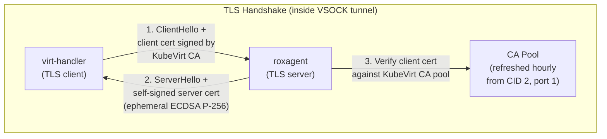

# VSOCK Pull Mode — 4. TLS

**Parent design:** [Production Design v2](2026-06-23-vsock-pull-mode-production-design.md)  
**Previous:** [3. Compatibility](2026-06-23-vsock-pull-mode-3-compatibility.md)  
**Next:** [5. Status & Follow-ups](2026-06-23-vsock-pull-mode-5-status.md)  
**Audience:** PR reviewers — how the VSOCK connection is secured

---

ACS monitors virtual machines by pulling security scan reports from an agent
(roxagent) running inside each VM. Sensor connects into the VM over VSOCK using
the KubeVirt subresource API, and roxagent responds with a cached vulnerability
report. This document describes how that VSOCK connection is secured with TLS.

---

## 1. Two TLS layers

The pull path crosses two independent TLS sessions:

```
Sensor ──WSS──▶ K8s API (virt-api) ──▶ virt-handler ══TLS══▶ roxagent
         ▲ standard K8s API TLS            ▲ KubeVirt VSOCK TLS
         (rest.Config certs/token)         (this document)
```

Sensor never does TLS directly to the VM. It passes `tls=true` in the websocket
query string; virt-handler then initiates a TLS **client** handshake into the VM
over VSOCK.

---

## 2. Trust model

| Question | Answer |
|----------|--------|
| What is defended? | Unauthorized host processes cannot read scan data — must present a valid KubeVirt client cert |
| How is VM identity established? | Sensor only dials VMs that Kubernetes reports as running (via VMI watch). Injecting a malicious VM into the scrape list would require compromising the Kubernetes or KubeVirt API — same trust boundary as `kubectl exec` |
| Why does no one validate the agent's server cert? | virt-handler initiates the VSOCK connection to a specific VM via its CID — a hypervisor-assigned identifier that cannot be spoofed by another VM. The VSOCK channel is point-to-point by design (no routing, no DNS), so virt-handler knows it is talking to the intended VM before TLS even starts. The ephemeral cert exists solely to satisfy TLS protocol requirements (key exchange needs a certificate); upstream KubeVirt connects with `InsecureSkipVerify: true` |
| Is there a plaintext fallback? | No. Sensor always dials with `tls=true`; agent exits if initial CA fetch fails |

---

## 3. TLS handshake



| Party | Role | Certificate | Validates |
|-------|------|-------------|-----------|
| virt-handler | TLS client | Signed by KubeVirt CA | Does **not** validate server cert (`InsecureSkipVerify`) |
| roxagent | TLS server | Self-signed ephemeral ECDSA | Validates client cert against KubeVirt CA (`RequireAndVerifyClientCert`) |

**Authentication flows agent → virt-handler** (not the usual direction): the agent
trusts callers only if they present a valid KubeVirt client certificate.

### TLS configuration

- `MinVersion`: TLS 1.2
- `ClientAuth`: `RequireAndVerifyClientCert`
- Cipher suites: Go's default negotiation (no explicit restriction)
- CA pool swap: `GetConfigForClient` callback returns a fresh `*tls.Config`
  per handshake with the latest pool — reads don't block each other

### Ephemeral server certificate

Generated once on agent start, never persisted (`selfSignedCert()` in `cmd/serve.go`):

- ECDSA P-256, 128-bit random serial
- Validity: `now - 1 min` to `now + 365 days`
- KeyUsage: `DigitalSignature`, ExtKeyUsage: `ServerAuth`
- No SAN (no DNS names, no IP addresses)

**No party validates this certificate** — not its identity, signature, or expiry.
virt-handler connects with `InsecureSkipVerify: true` and no `VerifyPeerCertificate`
callback (upstream: kubevirt `pkg/virt-handler/rest/console.go`, `VSOCKHandler`).
The validity period and other fields are functionally irrelevant; the cert exists
only because the TLS protocol requires the server to present one for key exchange.

---

## 4. KubeVirt CA distribution

roxagent fetches the CA via gRPC on VSOCK CID 2 (host), port 1 — virt-handler's
built-in CA distribution service.

- Method: `/kubevirt.vsock.system.v1.System/CABundle` (empty request)
- Response: protobuf `Bundle { bytes Raw = 1; }` — parsed manually with `protowire`
- **Raw-bytes gRPC codec**: avoids importing `kubevirt.io/client-go`, whose `init()`
  panics due to glog `-v` flag conflict ([kubevirt#16951](https://github.com/kubevirt/kubevirt/issues/16951))
- Fetch timeout: 10 seconds
- Result: PEM bundle parsed into `x509.CertPool`

### CA rotation

- **Refresh interval**: 1 hour (configurable via `WithRefreshInterval` in tests)
- **Atomic swap**: `sync.RWMutex` — `GetConfigForClient` readers don't block each other;
  writes hold the lock only during the brief pool pointer swap
- **Failure resilience**: if a refresh fails, the old CA pool stays in effect and the
  error is logged; automatic retry on next interval
- **Startup is fatal**: if the initial fetch fails, the agent exits — no degraded mode

---

## 5. TLS failure modes

| Failure | Behavior | Recovery |
|---------|----------|----------|
| Initial CA fetch fails (roxagent cannot obtain KubeVirt CA) | Agent exits | systemd restarts the container (`Restart=on-failure`, 10s delay); verify virt-handler is running |
| CA refresh fails (roxagent periodic re-fetch) | Old CA remains; error logged | Auto-retry next interval |
| virt-handler's client cert signed by wrong CA (roxagent rejects) | Handshake rejected by roxagent | Sensor retries next cycle |
| virt-handler connects without a client cert (roxagent requires one) | Handshake rejected by roxagent | N/A |
| Plaintext client connects to roxagent's TLS listener | TLS record error, warning logged, conn closed | roxagent continues serving |
| KubeVirt CA rotated (new certs issued to virt-handler) | Picked up by roxagent within 1 hour | Automatic |

---

## 6. Key files

| File | TLS responsibility |
|------|--------------------|
| `compliance/.../vsockserver/tls.go` | `FetchKubeVirtCA`, `rawBytesCodec`, `CARefresher`, `TLSConfig()` |
| `compliance/.../cmd/serve.go` | `selfSignedCert()`, startup orchestration (CA fetch → TLS config → listen) |
| `compliance/.../vsockserver/server.go` | `tls.NewListener` wrapping, connection state logging |
| `sensor/.../vsockdialer/dialer.go` | Passes `tls=true` to KubeVirt subresource API (Sensor-side) |
| `compliance/.../vsockserver/tls_test.go` | Handshake, wrong-CA rejection, refresh, failure resilience |
