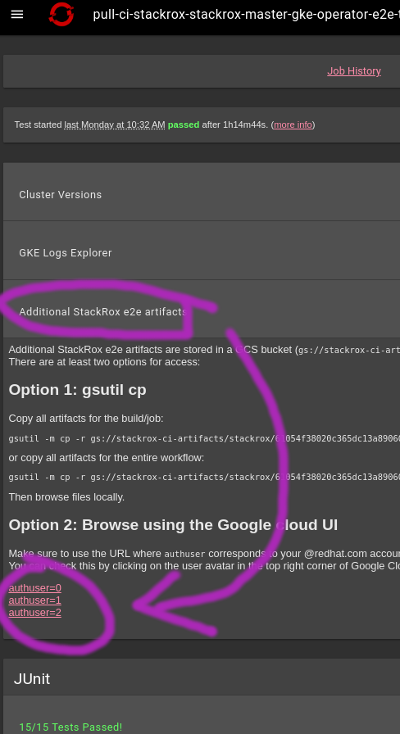
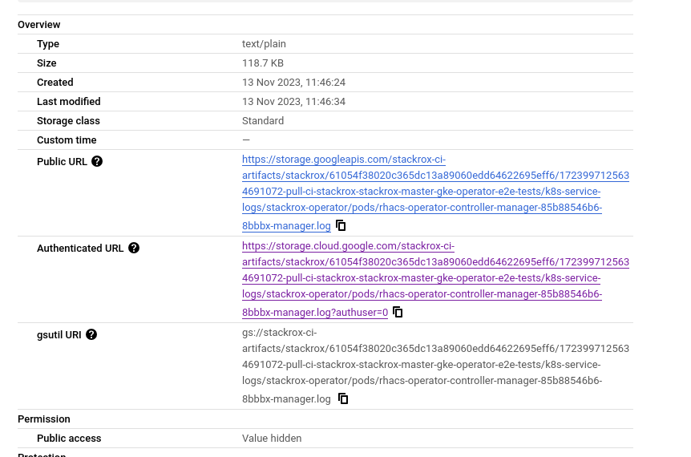

# Troubleshooting end-to-end operator tests

## Structure

All kuttl tests are in the [tests](.) directory. It contains four tests, contained in three suites:
- [central/central-basic](central/central-basic) - exercises some core `Central` CR features.
- [central/central-misc](central/central-misc) - various `Central` resource configurations and switching between them.
- [securedcluster/sc-basic](securedcluster/sc-basic) - various `SecuredCluster` resource configurations
  and switching between them. Separate, because we only support deploying a single `SecuredCluster` instance
  per cluster at a time.
- [upgrade/upgrade](upgrade/upgrade) - intended to be started on a cluster with the previously released operator
  version already installed. This test:
  1. creates a full stackrox installation and makes sure it's healthy,
  2. upgrades the operator to the version under test, makes sure it's running,
  3. verifies that the stackrox installation was upgraded and is still healthy.

Note that the `deploy-via-olm` and `deploy-previous-via-olm` targets in `Makefile` also use `kuttl` internally.
- `deploy-via-olm` is used by the `qa-e2e` CI jobs to deploy stackrox
- `deploy-previous-via-olm` is used by the `operator-e2e` CI jobs as described in the next section

## How these tests are run

In a CI job:
1. a previous operator version is installed first (a requirement of the upgrade test) using the `deploy-previous-via-olm` rule,
2. the upgrade test runs next; it leaves the cluster with current operator version installed,
3. then the `central` and `securedcluster` test suites are run _in parallel_.

An important fact is that `kuttl` creates a uniquely-named ephemeral namespace
(something like `kuttl-test-adjective-animal`) for every test, and deletes it afterwards.
Because of that the k8s service logs gathered by the CI harness are of limited usefulness.
However `kuttl` can be told to gather logs of selected pods after a given step.
We use this functionality (see `collectors` field in `TestAssert` pseudo-resources).

## How `kuttl` works

Each **test** (for example `tests/central/central-basic`) consists of a series of **steps**.
A step consists of a non-empty set of files prefixed with the same number and a dash.

What `kuttl` does to execute a test is:
1. prepare the test (e.g. create a namespace)
2. execute each step in a test in sequence until a step fails or all steps pass
3. clean up after test (e.g. deletes the namespace)

Now, how is a step executed?

There are three types of files in a step:
1. ones where the first word after the number and dash is `assert`
2. ones where the first word after the number and dash is `errors`
3. other files

To execute a step, `kuttl`
1. first does an equivalent of `kubectl apply` on those "other files",
2. then polls (until a timeout) comparing resources on cluster with descriptions of resources in the `assert` and `errors` category,
3. a step passes if and only if all assert files matched and none of the error files matched.

That's it!

In reality, there are also some special pseudo-resources that control details such as log collection,
perform deletions, but this is the main idea.

## The anatomy of a test output

In order to find the right spot, it is useful to know the structure of a given test output.

`kuttl` uses the Go testing libraries internally, so the general output format should be familiar.

Note: as mentioned before, the e2e tests are run in parallel, so their outputs will likely be at least somewhat interlaced.
Luckily, the framework separates outputs from different tests with messages such as:

```
=== CONT  kuttl/harness/sc-basic
[...]
=== CONT  kuttl/harness/central-basic
```

The examples below are limited to a single test, and I omit the `=== CONT` lines for brevity.

The output from a `kuttl` run is roughly as follows:

### Test harness startup

```
=== RUN   kuttl
harness.go:462: starting setup
harness.go:252: running tests using configured kubeconfig.
[...]
harness.go:360: running tests
harness.go:73: going to run test suite with timeout of 600 seconds for each step
harness.go:372: testsuite: ./tests/central has 1 tests
harness.go:73: going to run test suite with timeout of 600 seconds for each step
harness.go:372: testsuite: ./tests/securedcluster has 1 tests
=== RUN   kuttl/harness
```

Nothing very interesting here.

### Test startup

```
=== RUN   kuttl/harness/sc-basic
logger.go:42: 18:04:10 | sc-basic | Creating namespace: kuttl-test-natural-loon
```

This is important, as it shows which namespace a given test will run in.

### Successful test step

```
    logger.go:42: 17:30:56 | central-basic/75-enable-central-db-external | starting test step 75-enable-central-db-external
    logger.go:42: 17:30:59 | central-basic/75-enable-central-db-external | Secret:kuttl-test-wealthy-cockatoo/my-central-db-password created
    logger.go:42: 17:30:59 | central-basic/75-enable-central-db-external | Central:kuttl-test-wealthy-cockatoo/stackrox-central-services updated
    logger.go:42: 17:31:01 | central-basic/75-enable-central-db-external | test step completed 75-enable-central-db-external
```

A successful test step always starts with `starting test` and ends with `test step completed`.
In between there can be messages about what resources are mutated.

It is also possible that some messages from kubernetes libraries plumbing will be emitted. These are completely harmless:

```
I0126 17:32:00.275793    3247 request.go:682] Waited for 1.003842813s due to client-side throttling, not priority and fairness, request: GET:https://api.ci-ocp-4-8-amd64-aws-XXXXXXXXX-8brx5.hive.aws.ci.openshift.org:6443/apis/samples.operator.openshift.io/v1?timeout=32s
```

### Failed test step

#### Step progress

It begins similar to a successful step:

``` 
    logger.go:42: 02:12:54 | central-basic/10-central-cr | starting test step 10-central-cr
    logger.go:42: 02:13:00 | central-basic/10-central-cr | Central:kuttl-test-steady-fowl/stackrox-central-services created
    logger.go:42: 02:13:00 | central-basic/10-central-cr | Secret:kuttl-test-steady-fowl/admin-pass created
```

The ending is different, and there are a few important parts, which tell us the direct reason for failure.

#### Step failure message

First, just a message that tells us which step failed.

```
    logger.go:42: 02:23:01 | central-basic/10-central-cr | test step failed 10-central-cr
```

Note that at this point we still do not know **why** this step failed, this will be revealed a bit later.

#### Collector (i.e. pod log) outputs

The second piece is the output from any "collectors" defined in the assert file (if any).
Note the notion of `kuttl` [test assert collector](https://kuttl.dev/docs/testing/reference.html#collectors)
is completely unrelated to the stackrox collector component.
We typically request fetching logs of all the pods that comprise deployments on which we make any status assertions.

Here is an example snippet that shows `central` and beginning of `scanner` logs:

```
    logger.go:42: 02:23:01 | central-basic/10-central-cr | collecting log output for [type==pod,label: app=central]
    logger.go:42: 02:23:01 | central-basic/10-central-cr | running command: [kubectl logs --prefix -l app=central -n kuttl-test-steady-fowl --all-containers --tail=-1]
    logger.go:42: 02:23:01 | central-basic/10-central-cr | [pod/central-f959bb7c5-rlz2c/central] '/usr/local/share/ca-certificates/00-foo.pem.crt' -> '/etc/pki/ca-trust/source/anchors/00-foo.pem.crt'
    logger.go:42: 02:23:01 | central-basic/10-central-cr | [pod/central-f959bb7c5-rlz2c/central] '/etc/pki/injected-ca-trust/tls-ca-bundle.pem' -> '/etc/pki/ca-trust/source/anchors/tls-ca-bundle.pem'
    logger.go:42: 02:23:01 | central-basic/10-central-cr | [pod/central-f959bb7c5-rlz2c/central] Migrator: 2023/02/07 02:19:34.219239 log.go:18: Info: Run migrator.run() with version: 3.74.x-21-ge2ac78b3b8, DB sequence: 172
    logger.go:42: 02:23:01 | central-basic/10-central-cr | [pod/central-f959bb7c5-rlz2c/central] Migrator: 2023/02/07 02:19:34.219527 log.go:18: Info: conf.Maintenance.ForceRollbackVersion: none
    logger.go:42: 02:23:01 | central-basic/10-central-cr | [pod/central-f959bb7c5-rlz2c/central] Migrator: 2023/02/07 02:19:34.219609 log.go:18: Info: Migrator failed: unable to get Postgres DB config: pgsql: could not load password file "/run/secrets/stackrox.io/db-password/password": open /run/secrets/stackrox.io/db-password/password: no such file or directory
    logger.go:42: 02:23:01 | central-basic/10-central-cr | collecting log output for [type==pod,label: app=scanner]
    logger.go:42: 02:23:01 | central-basic/10-central-cr | running command: [kubectl logs --prefix -l app=scanner -n kuttl-test-steady-fowl --all-containers --tail=-1]
    logger.go:42: 02:23:01 | central-basic/10-central-cr | [pod/scanner-689bb74f5f-kt6xx/scanner] '/usr/local/share/ca-certificates/00-foo.pem.crt' -> '/etc/pki/ca-trust/source/anchors/00-foo.pem.crt'
    logger.go:42: 02:23:01 | central-basic/10-central-cr | [pod/scanner-689bb74f5f-kt6xx/scanner] '/etc/pki/injected-ca-trust/tls-ca-bundle.pem' -> '/etc/pki/ca-trust/source/anchors/tls-ca-bundle.pem'
    [...]
```

#### Assertion diff

Then a comparison of expected (specified in YAML files) and actual (seen on the cluster) resources as a unified diff.

```
    case.go:364: failed in step 10-central-cr
    case.go:366: --- Deployment:kuttl-test-steady-fowl/central
        +++ Deployment:kuttl-test-steady-fowl/central
        @@ -1,8 +1,616 @@
         apiVersion: apps/v1
         kind: Deployment
         metadata:
        +  annotations:
        +    email: support@stackrox.com
        [...]
         status:
        -  availableReplicas: 1
        +  conditions:
        +  - lastTransitionTime: "2023-02-07T02:13:19Z"
        +    lastUpdateTime: "2023-02-07T02:13:19Z"
        +    message: Deployment does not have minimum availability.
        +    reason: MinimumReplicasUnavailable
        +    status: "False"
        +    type: Available
        +  - lastTransitionTime: "2023-02-07T02:13:19Z"
        +    lastUpdateTime: "2023-02-07T02:13:19Z"
        +    message: ReplicaSet "central-f959bb7c5" is progressing.
        +    reason: ReplicaSetUpdated
        +    status: "True"
        +    type: Progressing
        +  observedGeneration: 1
        +  replicas: 1
        +  unavailableReplicas: 1
        +  updatedReplicas: 1      
```

#### Failed condition

Then, the condition that caused the step to fail:

```
    case.go:366: resource Deployment:kuttl-test-steady-fowl/central: .status.availableReplicas: key is missing from map
```

This is useful, since the diff above can be quite long.

#### Events dump

Finally, a dump of all events from the test namespace.
This also can get quite long but sometimes contains important information.

```
    logger.go:42: 02:23:02 | central-basic | central-basic events from ns kuttl-test-steady-fowl:
    logger.go:42: 02:23:02 | central-basic | 2023-02-07 02:13:15 +0000 UTC	Normal	PersistentVolumeClaim central-db		WaitForFirstConsumer	waiting for first consumer to be created before binding
    logger.go:42: 02:23:02 | central-basic | 2023-02-07 02:13:15 +0000 UTC	Normal	PersistentVolumeClaim stackrox-db		WaitForFirstConsumer	waiting for first consumer to be created before binding
    logger.go:42: 02:23:02 | central-basic | 2023-02-07 02:13:19 +0000 UTC	Normal	ReplicaSet.apps central-f959bb7c5		SuccessfulCreate	Created pod: central-f959bb7c5-rlz2c
    [...]
    logger.go:42: 02:23:02 | central-basic | 2023-02-07 02:15:23 +0000 UTC	Normal	Pod scanner-db-bb9f74864-gmr2m.spec.containers{db}		Created	Created container db
    logger.go:42: 02:23:02 | central-basic | 2023-02-07 02:15:23 +0000 UTC	Normal	Pod scanner-db-bb9f74864-gmr2m.spec.containers{db}		Started	Started container db
```

### Test cleanup

Finally, a notice about cleanup:

```
    logger.go:42: 02:23:02 | central-basic | Deleting namespace: kuttl-test-steady-fowl
```

### Test harness teardown

And then the whole harness teardown:

```
    harness.go:405: run tests finished
    harness.go:513: cleaning up
    [...]
--- FAIL: kuttl (633.12s)
    --- FAIL: kuttl/harness (0.00s)
        --- PASS: kuttl/harness/sc-basic (419.53s)
        --- FAIL: kuttl/harness/central-basic (625.20s)
FAIL
make: *** [Makefile:281: test-e2e-deployed] Error 1
make: Leaving directory '/go/src/github.com/stackrox/stackrox/operator'
```

## How to troubleshoot `kuttl` failures

### Identify **which test** failed

Look for the harness teardown message near the bottom that contains the names of failing and passing tests.

In the example above we see that the `sc-basic` test (from `operator/tests/securedcluster/`) test **passed**,
and only the `central-basic` test (from `operator/tests/central/`) **failed**.

### Identify **which test step** failed

Keeping in mind the name of the failing test (`central-basic` in this example) and ignoring the irrelevant (i.e. successful)
test (`sc-basic` in this example), scroll up from the final `FAIL: kuttl` until you find the message about
the condition that caused the step to fail.

In the example above, the failing step is `10-central-cr`.

### Identify why it failed

Try to understand from the step name what it intended to assert.
Look at the comments inside the step's files if there are any.

Once you understand that, try to figure out what went wrong by looking at the events and pod log messages.

In the example above, the step tried to assert that the `central` deployment had exactly one healthy replica.

The exact piece of the `10-assert.yaml` file is:
```yaml
apiVersion: apps/v1
kind: Deployment
metadata:
  name: central
status:
  availableReplicas: 1
```

However, in the resource on the cluster the `status.availableReplicas` field never appeared.

We see in the diff that `status.unavailableReplicas` is `1` which means the central pod never became healthy.
The reason for that in turn is visible from the pod log collected by `kuttl`.
In this example, the db password file is missing for some reason.

#### Retrieving operator controller logs

Usually if there is any error in the operator controller, it will be surfaced in the custom resource `.status`
field. However, in some cases it may be useful to see the log.

It is not fetched by the [kuttl collectors](#collector-ie-pod-log-outputs) because the operator controller manager
pod runs in a separate namespace. However it is collected by the test job's log collection machinery.

The easiest way to retrieve it for a failed test job run on OpenShift CI is to go to the
"Additional StackRox e2e artifacts" bucket for the job by selecting the right link under the drop-down
on the job status page:



... then follow the path `k8s-service-logs/stackrox-operator/pods` ...


... finally select the file ending with `-manager.log` ...


... and pick the "Authenticated URL" link to see it.



Then, scroll to the timestamp around the time of the failure reported by `kuttl`.

### If everything fails

If you still do not know what is going on, please do not hesitate to ask!
Please do not ignore those failures - if something failed in these tests,
it will most likely fail in some case for the end user too!
