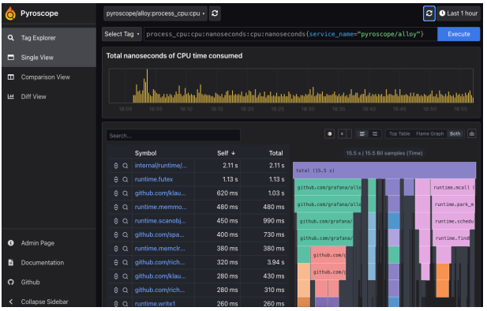
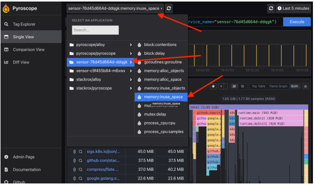
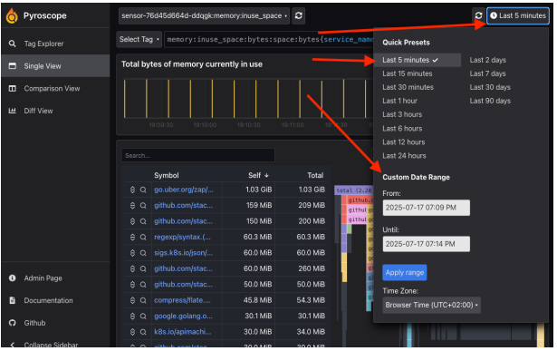
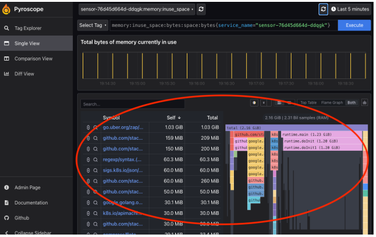
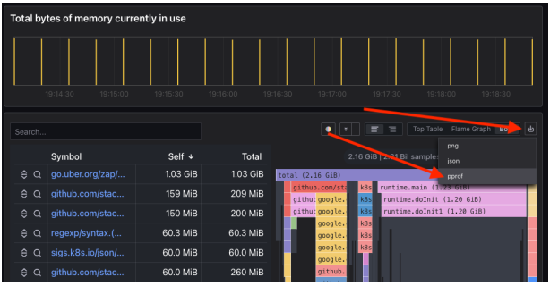

# How to Pyroscope

## Introduction

The Pyroscope integration in ACS allows us to enable continuous profiling to better diagnose ACS components. In order to achieve this we need to:

- Install Pyrocope.
- [Optional] Expose Pyroscope.
- Configure ACS components to push profiling information to Pyroscope.

## Install Pyroscope via Helm

First create the pyroscope namespace:

```bash
kubectl create ns pyroscope
```

Then install Pyroscope in the pyroscope namespace:

```bash
helm repo add grafana https://grafana.github.io/helm-charts
helm repo update
helm -n pyroscope install pyroscope grafana/pyroscope
```

## Expose Pyroscope

> [!NOTE]
> If Pyroscope is installed in the same cluster where ACS is running this step can be skipped.

Create the following service in the pyroscope namespace:

```yaml
apiVersion: v1
kind: Service
metadata:
  annotations:
    meta.helm.sh/release-name: pyroscope
    meta.helm.sh/release-namespace: pyroscope
  labels:
    app.kubernetes.io/name: pyroscope
  name: pyroscope-lb
  namespace: pyroscope
spec:
  ports:
  - name: http2
    port: 4040
    protocol: TCP
    targetPort: http2
  selector:
    app.kubernetes.io/component: all
    app.kubernetes.io/instance: pyroscope
    app.kubernetes.io/name: pyroscope
  type: LoadBalancer
```

### Access the Pyroscope UI

Once the service is fully created the Pyroscope UI can be accessed through the external IP of that service in port 4040. In this example 34.9.100.172:4040.

```bash
$ kubectl -n pyroscope get svc
NAME                      TYPE           CLUSTER-IP       EXTERNAL-IP    PORT(S)          AGE
pyroscope-lb              LoadBalancer   34.118.224.139   34.9.100.172   4040:30303/TCP   6m33s
```

If the load balancer wasn't created in the previous section, the UI can be accessed via port-forward:

```bash
kubectl --namespace pyroscope port-forward svc/pyroscope 4040:4040
```

In both scenarios something like the following should be seen:



## Configure ACS components

All go-based ACS components can be configured to send profiles to Pyroscope through the following environmental variables:

- `ROX_CONTINUOUS_PROFILING`: `<true/false>` enables continuous profiling.
- `ROX_CONTINUOUS_PROFILING_SERVER_ADDRESS`: Pyroscope's server address.
- `ROX_CONTINUOUS_PROFILING_BASIC_AUTH_USER`: the https basic auth user (if configured).
- `ROX_CONTINUOUS_PROFILING_BASIC_AUTH_PASSWORD`: the https basic auth password (if configured).
- `ROX_CONTINUOUS_PROFILING_APP_NAME`: overrides the default name that would be used to send the profiles. By default it's the pod's name.

Example of how to configure Sensor using the load-balancer service:

```bash
kubectl -n stackrox set env deploy/sensor ROX_CONTINUOUS_PROFILING=true ROX_CONTINUOUS_PROFILING_SERVER_ADDRESS=http://<external-ip>:4040
```

Example of how to configure Sensor using the default cluster-ip service:

```bash
kubectl -n stackrox set env deploy/sensor ROX_CONTINUOUS_PROFILING=true ROX_CONTINUOUS_PROFILING_SERVER_ADDRESS=http://pyroscope.pyroscope.svc.cluster.local.:4040
```

## Looking at the profiles in the UI

In the UI, the component and the desired monitored profile can be selected in the dropdown in the top left corner of the main view:



The time period can be selected by clicking in the top right corner and selecting one of the predefined presets or a custom one:



It is also possible to make a selection time diagram in the middle.

The actual profile data can be seen in the bottom section:



To export the data click on 'Export Data' as it shown in the following picture:


