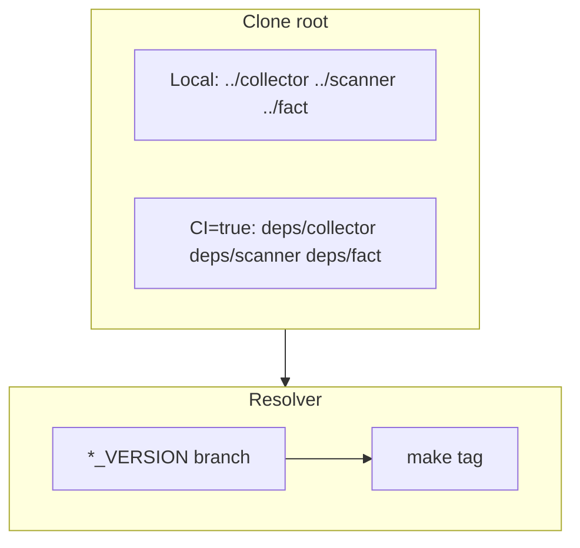

# VERSION files as upstream branch refs + `make tag` resolution

## Locked decisions

1. **Upstream clone paths:** Implement resolver defaults as **`../collector`, `../scanner`, `../fact`** (sibling directories next to the stackrox checkout). When **`CI=true`**, default roots switch to **`deps/collector`, `deps/scanner`, `deps/fact`**. In GitHub Actions (and other CI) jobs that need resolution, **check out** `stackrox/collector`, `stackrox/scanner`, and **`stackrox/fact`** under **`deps/`** so those paths exist in the job workspace. Allow env overrides if useful (document `COLLECTOR_REPO`, etc., only if implemented).

2. **Fact repository:** **`github.com/stackrox/fact`** (`stackrox/fact`).

3. **`check_scanner_version` / `check_collector_version` / `check_fact_version`:** Replace GA-tag enforcement (`is_release_version`) with **validation that the branch name in each `*_VERSION` file exists on the corresponding upstream remote** (e.g. `git ls-remote` / equivalent). That is **sufficient**; no requirement that the resolved `make tag` output be a release semver.

4. **Periodic automation:** **Remove** the automated bump workflows — delete or disable [`.github/workflows/update_scanner_periodic.yaml`](.github/workflows/update_scanner_periodic.yaml) and [`.github/workflows/update_collector_periodic.yaml`](.github/workflows/update_collector_periodic.yaml). Branch names in `*_VERSION` are updated **manually** or via normal release processes, not by scheduled bots.

5. **Offline / reproducible builds (generated lockfile):** **Defer.** Mark as **TODO for later** — optional checked-in artifact listing resolved tags per stackrox commit for reproducibility without cloning upstreams. **Not part of the initial implementation.**

---

## Direction (in scope)

| File | Upstream repository | Makefile target |
|------|---------------------|-----------------|
| `COLLECTOR_VERSION` | `stackrox/collector` | `collector-tag` |
| `SCANNER_VERSION` | `stackrox/scanner` | `scanner-tag` |
| `FACT_VERSION` | **`stackrox/fact`** | `fact-tag` |

Each file holds a **branch name**. The **image tag** is **`$(make -s tag)`** in that repo after checking out that branch.

---

## Unified resolver (conceptual)

For each component, read branch `B` from `*_VERSION`, locate clone at **`../<repo>`** or **`deps/<repo>`** per rules above, **fetch**, **`git checkout B`**, output **`$(make -s tag)`** from that repository.

---

## Why this is larger than “relax pinning”

[`Makefile`](Makefile) currently **`cat`s VERSION files**. Resolved tags are computed at use time unless a future lockfile (TODO) is added.

---

## Call sites and required changes (all three)

### Makefile and local dev

| Target | Today | Change |
|--------|--------|--------|
| `collector-tag`, `scanner-tag`, `fact-tag` | `@echo $$(cat *_VERSION)` | Shared script: resolve clone root (`../*` vs `deps/*`), checkout branch from file, **`make tag`**. Document **local** expectation: sibling clones `../collector`, `../scanner`, `../fact`, or override env vars if implemented. |

### Shell / release automation

| Location | Change |
|----------|--------|
| [`scripts/ci/lib.sh`](scripts/ci/lib.sh) — retag + `check_*_version` | Resolve tags after upstream checkout where needed; **`check_*_version`** → **remote branch exists** for each `*_VERSION` line (three remotes: collector, scanner, fact). |

### GitHub Actions

| Workflow | Change |
|----------|--------|
| [`style.yaml`](.github/workflows/style.yaml) `check-dependent-images-exist` | Checkout three repos under **`deps/`**, set **`CI=true`** (or rely on GHA default), resolve tags, run `wait-for-image`. |
| [`release-ci.yaml`](.github/workflows/release-ci.yaml) | Align with same checkout + branch checks. |
| **`update_*_periodic.yaml`** | **Remove** [`update_scanner_periodic.yaml`](.github/workflows/update_scanner_periodic.yaml) and [`update_collector_periodic.yaml`](.github/workflows/update_collector_periodic.yaml). |

### Konflux / Tekton

Clone/checkout upstream repos in workspace layout compatible with **`CI=true` + `deps/*`**, then reuse same resolution as GHA (prefer shared Tekton task logic with [`retag-pipeline`](.tekton/retag-pipeline.yaml)).

### Tests and runtime

Same as prior plan: BATS, [`tests/upgrade/lib.sh`](tests/upgrade/lib.sh), [`postgres_run.sh`](tests/upgrade/postgres_run.sh), [`tests/versions_test.go`](tests/versions_test.go), [`pkg/version/internal/version_data.go`](pkg/version/internal/version_data.go).

---

## Verification

- Local (no `CI`): sibling repos `../collector` etc. on branches matching `*_VERSION` → `make *-tag` matches upstream `make tag`.
- CI: `CI=true`, clones under `deps/` → same equality.
- `check_*_version` passes only when remote branches exist; fails clearly when branch missing.
- Style matrix + Tekton retag still find images for **resolved** tags.

---

## Open Questions & Implementation Concerns

### 1. Resolver Implementation & Code Sharing
- **Where should the branch→tag resolver logic live?**
  - Shell function in `scripts/ci/lib.sh`?
  - Standalone script like `scripts/ci/resolve-dependency-tag.sh`?
  - Inline in each Makefile target?
- **How to share logic across Makefile, GHA, and Tekton?** Currently they all need to resolve tags with different mechanisms.

### 2. Clone Path Configuration
- **What environment variables should control paths?**
  - Individual: `COLLECTOR_REPO_PATH`, `SCANNER_REPO_PATH`, `FACT_REPO_PATH`?
  - Pattern-based: `DEPS_ROOT` defaulting to `..` or `deps/`?
  - Just rely on `CI=true` detection?
- **Should paths be configurable per-component** or follow strict pattern?

### 3. Makefile Design
- **Should resolution be cached within a single Make invocation?** If `collector-tag` is called multiple times, should it re-resolve or cache?
- **Error handling:** What should `make collector-tag` do if:
  - The upstream repo doesn't exist at the expected path?
  - The branch in VERSION file doesn't exist?
  - `make tag` fails in the upstream repo?
- **Should there be a fallback mode** that treats VERSION files as literal tags if resolution fails?

### 4. Transition Strategy
- **Can this be done atomically** or do we need intermediate states?
- **What branch names should VERSION files contain after the change?**
  - `master` for all three?
  - Specific release branches like `release-3.24`?
  - Development branches?
- **How to handle the initial migration commit?** Change all three VERSION files simultaneously?

### 5. CI Checkout Strategy - GitHub Actions
- **Should style.yaml check out all three repos upfront** in separate steps, or on-demand during resolution?
- **What git depth is needed?** Shallow (1) or deep (0) to ensure `make tag` works correctly?
- **Should we use git submodules** instead of explicit checkouts?

### 6. CI Checkout Strategy - Tekton/Konflux
- **How to integrate with Trusted Artifacts?** Current `determine-dependency-image-tag` task:
  - Uses a Trusted Artifact containing only the stackrox repo
  - Runs `make collector-tag` which currently just cats VERSION file
  - **After the change:** needs access to `deps/collector`, `deps/scanner`, `deps/fact` repos
- **Should we:**
  - Create a new task that checks out all three dependency repos?
  - Modify existing task to accept multiple source artifacts?
  - Pre-populate `deps/` in a previous pipeline step?
- **How does this interact with the Tekton workspace model?**

### 7. Branch Validation Logic
- **For `check_*_version` functions:**
  - Should they use `git ls-remote https://github.com/stackrox/{repo}` directly?
  - Or clone the repo first?
  - What about GitHub API rate limiting?
- **Should validation allow alternative remotes** (e.g., forks) or strictly enforce stackrox org?

### 8. Fact Repository Readiness
- **Does `stackrox/fact` have a `make tag` target** that works like collector/scanner?
- **Is the fact repo structure similar enough** to collector/scanner for this approach?
- **Should we verify this before implementing?**

### 9. Testing Strategy
- **How to test locally without breaking CI?**
  - Create test branches in collector/scanner/fact repos?
  - Use a feature flag during development?
- **What BATS tests need updating** beyond checking release version format?
- **How to test the Tekton changes** without risking production builds?

### 10. Embedded Version Data
- **`pkg/version/internal/version_data.go`** gets populated via XDef markers from `status.sh`
- `status.sh` calls `make collector-tag`, etc.
- **After the change, embedded versions will be resolved tags** (e.g., `3.24.4-123-gabc1234`)
  - Is this acceptable?
  - Or do embedded versions need to remain "clean" semver?
- **`tests/versions_test.go` validates version kinds match** — will branch-resolved tags break this?

### 11. Backward Compatibility
- **Are there external consumers of VERSION files?**
  - Other repos/tools that read these files?
  - Documentation that references them?
  - Release processes that depend on them being semver?
- **Does the operator or other components parse VERSION files directly?**
- Found references in:
  - `.github/labeler.yml`
  - `.github/CODEOWNERS`
  - `pkg/env/collector.go` and `pkg/env/fact.go`

### 12. Performance & Caching
- **Should CI cache the `deps/` clones** between workflow steps?
- **What's the performance impact** of checking out 3 additional repos in every CI run?
- **Clone depth:** Shallow clones might not have enough history for `make tag` — what's the minimum depth needed?

### 13. Documentation Requirements
- **Where to document the new model?**
  - Update `AGENTS.md`?
  - Create new `DEPENDENCIES.md`?
  - Update developer onboarding docs?
- **What should docs cover?**
  - Local development setup (how to clone sibling repos)
  - How to update VERSION files (manual process now)
  - Troubleshooting when resolution fails

### 14. Offline/Reproducible Builds (Deferred but plan-ahead)
- The plan defers the lockfile feature, but:
  - **Should we design the resolver to make adding a lockfile easier later?**
  - **What format should the lockfile use?** (JSON, YAML, plain text?)
  - **Where should it live?** (Root of repo? Under `.konflux/`?)

### 15. Version File Update Workflow
- **Without periodic automation, how will VERSION files be updated?**
  - Manual PRs?
  - Release process?
  - On-demand workflow_dispatch triggers?
- **Should we keep the workflows but change them to manual** instead of deleting entirely?

### 16. Existing Integrations - Need Inventory
Found these call sites that may need updates:
- `scripts/ci/lib.sh` — `check_scanner_version`, `check_collector_version`, `check_fact_version` (lines 1065-1084)
- `scripts/ci/lib.sh` — `push_matching_collector_scanner_images` uses `make scanner-tag`/`collector-tag`/`fact-tag` (lines 518-559)
- `tests/upgrade/lib.sh` — Uses `cat SCANNER_VERSION` directly (lines 108-109)
- `status.sh` — Calls all three `make *-tag` targets (lines 5-7)
- `pkg/version/internal/version_data.go` — XDef markers populated from `status.sh`
- `.github/workflows/style.yaml` — `check-dependent-images-exist` job (lines 165-212)
- `.github/workflows/release-ci.yaml` — Three separate check jobs (lines 47-84)

**Are there more?** Need comprehensive grep for all uses.

---

## Recommended Pre-Implementation Steps

1. **Validate fact repo compatibility:** Verify `stackrox/fact` has working `make tag` target
2. **Create prototype resolver script** to test locally with actual collector/scanner/fact clones
3. **Design Tekton integration** — this is the most complex piece given Trusted Artifacts constraint
4. **Document transition plan** — which VERSION values to use, in what order to make changes
5. **Create proof-of-concept PR** for just Makefile changes to validate approach
6. **Inventory all VERSION file consumers** — comprehensive audit beyond what's listed above
