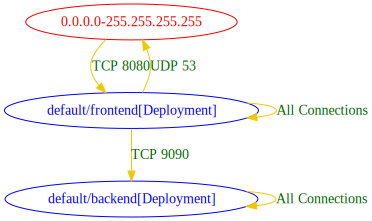

# Static Network Policy Analysis and Visualization

## Developer Preview Notice
The static network policy analysis feature is offered as a developer preview feature. While we are open to receiving feedback about this feature, our technical support will not be able to assist and answer questions about it.

## About
The static network policy analyzer is a tool that analyzes Kubernetes network policies.
Based on a given folder containing deployment and network policy YAMLs, it analyzes the permitted cluster connectivity.
It produces a list of **allowed** connections based on the workloads and network policies defined.
It is based on [NP-Guard's Network Policy Analyzer](https://github.com/np-guard/netpol-analyzer) component.
For more details, refer to the [NP-Guard webpage](https://np-guard.github.io/).

## Command Objective
Generate a file that allows users to visualize the connectivity posture induced by the network policies generated by `roxctl generate netpol`.

## Usage

### Analyzing allowed connectivity from YAML manifests (network policies and workload resources)
To analyze network policies, `roxctl connectivity-map` requires a folder containing Kubernetes manifests, including network policies.
The manifests must not be templated (e.g., Helm charts) to be considered.
All YAML files that could be accepted by `kubectl apply -f` will be accepted as a valid input and searched by `roxctl connectivity-map`.

Example run with output to `stdout`:

```shell
$ roxctl connectivity-map  tests/roxctl/bats-tests/test-data/np-guard/netpols-analysis-example-minimal/
0.0.0.0-255.255.255.255 => default/frontend[Deployment] : TCP 8080
default/backend[Deployment] => default/backend[Deployment] : All Connections
default/frontend[Deployment] => 0.0.0.0-255.255.255.255 : UDP 53
default/frontend[Deployment] => default/backend[Deployment] : TCP 9090
default/frontend[Deployment] => default/frontend[Deployment] : All Connections
```

Example output with `md` output format:
```shell
$ roxctl connectivity-map  tests/roxctl/bats-tests/test-data/np-guard/netpols-analysis-example-minimal/ -o md
```

| src | dst | conn |
|-----|-----|------|
| 0.0.0.0-255.255.255.255 | default/frontend[Deployment] | TCP 8080 |
| default/backend[Deployment] | default/backend[Deployment] | All Connections |
| default/frontend[Deployment] | 0.0.0.0-255.255.255.255 | UDP 53 |
| default/frontend[Deployment] | default/backend[Deployment] | TCP 9090 |
| default/frontend[Deployment] | default/frontend[Deployment] | All Connections |

#### Understanding the output

The output contains a list of permitted connectivity lines. Each connectivity line is of the format `src => dst : connnectivity-attributes`.
The `src, dst` can be any of the analyzed cluster workloads or an IP address range.
A cluster workload is of the format: `namespace/name[kind]` , such as: `default/backend[Deployment]`.
If both `src` and `dst` are cluster workloads, it means that both `src` is allowed to send traffic to `dst` and that `dst` is allowed to receive traffic from `src` over the specified connectivity attributes.

If one of `src` or `dst` are IP address ranges, it means that only one direction of this connection (either egress from workload or ingress to workload) is explicitly permitted by network policies.

For example, in the above output, the line: `default/frontend[Deployment] => 0.0.0.0-255.255.255.255 : UDP 53` specifies permitted egress from `frontend` to any IP address.
It does not mean that a connection from `frontend`  to `backend` is allowed over UDP 53. This connection is actually blocked because of the `backend` workload's network policy, which only allows ingress over TCP 9090.

### Visualization

Generate output in [dot](https://graphviz.org/doc/info/lang.html) format:
```shell
$ roxctl connectivity-map tests/roxctl/bats-tests/test-data/np-guard/netpols-analysis-example-minimal/ -o dot
digraph {
        "0.0.0.0-255.255.255.255" [label="0.0.0.0-255.255.255.255" color="red2" fontcolor="red2"]
        "default/backend[Deployment]" [label="default/backend[Deployment]" color="blue" fontcolor="blue"]
        "default/frontend[Deployment]" [label="default/frontend[Deployment]" color="blue" fontcolor="blue"]
        "0.0.0.0-255.255.255.255" -> "default/frontend[Deployment]" [label="TCP 8080" color="gold2" fontcolor="darkgreen"]
        "default/backend[Deployment]" -> "default/backend[Deployment]" [label="All Connections" color="gold2" fontcolor="darkgreen"]
        "default/frontend[Deployment]" -> "0.0.0.0-255.255.255.255" [label="UDP 53" color="gold2" fontcolor="darkgreen"]
        "default/frontend[Deployment]" -> "default/backend[Deployment]" [label="TCP 9090" color="gold2" fontcolor="darkgreen"]
        "default/frontend[Deployment]" -> "default/frontend[Deployment]" [label="All Connections" color="gold2" fontcolor="darkgreen"]
}
```

Use [`Graphviz`](https://graphviz.org/) (locally installed or online viewer) to produce the connectivity graph.

Produced graph for the above example is depicted below:




### Analysis of Ingress/Route resources

In addition to network policies, the connectivity analysis also considers `Kubernetes Ingress` and `Openshift Route` resources.
For connections inferred from Ingress/Route resources, the src is specified as `{ingress-controller}`, representing the cluster's ingress controller Pod. 
Its connectivity lines are of the form: `{ingress-controller} => dst : connections`, where `dst` is a workload in the cluster.
This analysis assumes that the ingress controller Pod is unknown, and thus using this notation of `{ingress-controller}`.

Since the analysis assumes the manifest of the ingress controller is unknown, it checks whether an arbitrary workload can access (by network policies) the destination workloads specified in Ingress/Route rules. 
If such access is not permitted by network policies, this connection is removed from the report. 
It may be an allowed connection if a network policy specifically allows ingress access to that workload from a specific workload/namespace of the actual ingress controller installed.

### Parameters

The output can be redirected to a file by using `--output-file` parameter.

The output format can be set by using the `--output-format` parameter.
Supported output formats: `txt, md, csv, json, dot`. The `dot` output format is the one to be used for visualizing the output as a connectivity graph.
The [`Graphviz` tool](https://graphviz.org/) (locally installed or online viewer) can be used to convert the `dot` output to a graph in a format such as `svg/jpeg/png`.

The `--focus-workload` parameter allows specifying a workload name, such that the output only contains allowed connections of this workload, whereas the other workloads are omitted.

When running in a CI pipeline, `roxctl connectivity-map` may benefit from the `--fail` option that stops the processing on the first encountered error.

Using the `--strict` parameter produces an error "_there were errors during execution_" if any warnings appeared during the processing. Note that the combination of `--strict` and `--fail` will not stop on the first warning, as the interpretation of warnings as errors happens at the end of execution.
