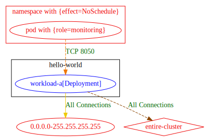

# Exposure analysis

The goal of exposure analysis, is to provide additional information of potential permitted connectivity to the output of `roxctl netpol connectivity map` command.

The report contains hints to where network policies may be tightened, or help validate that no unexpected exposure is present due to policies misconfiguration.

Exposure-analysis is supported with `txt, md, csv, json, dot` output formats.

### Textual Output Example

Example run with `txt` output to `stdout`:
```shell
$ roxctl netpol connectivity map --exposure tests/roxctl/bats-tests/test-data/np-guard/exposure-example
hello-world/workload-a[Deployment] => 0.0.0.0-255.255.255.255 : All Connections

Exposure Analysis Result:
Egress Exposure:
hello-world/workload-a[Deployment]      =>      0.0.0.0-255.255.255.255 : All Connections
hello-world/workload-a[Deployment]      =>      entire-cluster : All Connections

Ingress Exposure:
hello-world/workload-a[Deployment]      <=      [namespace with {effect=NoSchedule}]/[pod with {role=monitoring}] : TCP 8050

Workloads not protected by network policies:
hello-world/workload-a[Deployment] is not protected on Egress
```

#### Understanding the output

The results of exposure analysis are reported in a new `Exposure Analysis Result` section, which contains three parts:
1. `Egress Exposure`: provides potentially permitted egress exposure of input workloads;
each line is of the format `src => dst : connnectivity-attributes` where:
    - `src` is a workload from the input manifests.
    - `dst` is an entity represented by namespace and pod labels that appear in policy rules, but do not have a match in the input workload resources;\
    note that: 
        - if `dst` represents all possible namespaces and pods in the cluster `entire-cluster` label is used.
        - if `dst` represents possible external entity(ies), IP addresses range is used
    - `connnectivity-attributes` the potentially permitted egress connection from src to dst.
2. `Ingress Exposure`: provides the potentially permitted ingress exposure of input workloads;
each line is of the format `dst <= src : connnectivity-attributes` where:
    - `dst` is a workload from the input manifests.
    - `src` is an entity represented by namespace and pod labels that were matched by policy rules, but do not have a match in the input workload resources;\
    note that:
        - if `src` represents all possible namespaces and pods in the cluster `entire-cluster` label is used.
        - if `src` represents possible external entity(ies), IP addresses range is used
    - `connnectivity-attributes` the potentially permitted ingress connection from src to dst.
3. `Workloads not protected by network policies`: lists input workloads which are not selected by any input network-policy that affects the mentioned direction, and thus exposed widely.\
Note that those workloads appear also in the exposure section of that direction within two exposure lines; since an unprotected workload is exposed to whole world, i.e: all external addresses `0.0.0.0-255.255.255.255` and `entire-cluster`.

### Visual Output Example:

The following graph is produced from the output of `$ roxctl netpol connectivity map --exposure tests/roxctl/bats-tests/test-data/np-guard/exposure-example -o dot`:



#### Understanding the graph

- `gold` edges are edges produced by the original connectivity map report
- `blue` nodes and labels represent input workloads.
- `black` frames and labels represent namespaces of input manifests
- `red` nodes and labels are used to represent: 
    - representative entities which are matched by policy rules, but do not exist in the input manifests
    - external IP addresses
- `red` diamond with an `entire-cluster` label inside is used to represent the entire cluster entity
-  `dashed orange` edges represent ingress connections which are reported by running exposure analysis
- `dashed dark orange` edges represent egress connections which are reported by running exposure analysis


