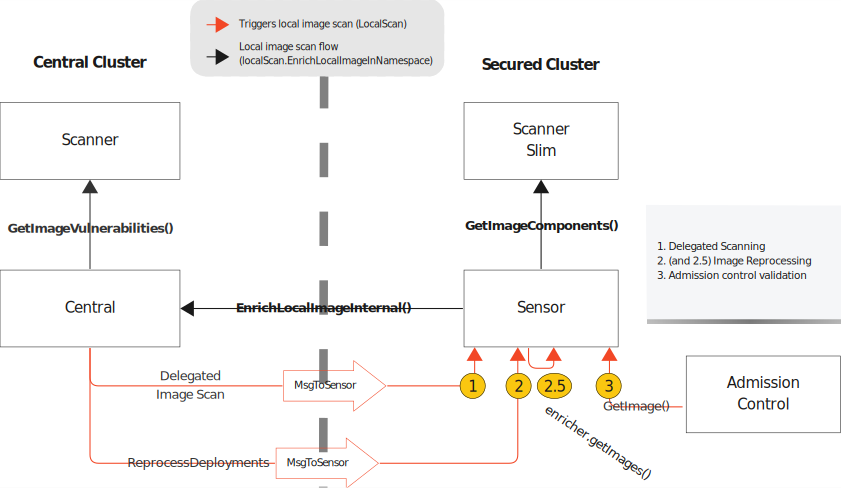

# 0002 - Local Scanning with Scanner V4

- **Author(s):** J. Victor Martins <jvdm@sdf.org>
- **Created:** 2023-08-03

## Status

Accepted.

## Context

Local scanning is the scenario where the container image is pulled and indexed (aka. analyzed) in the secured cluster and sent to Central for vulnerability reporting (aka. scanned).



Currently, Sensor and Central coordinate the calls to Scanner and Scanner Slim. The local image scanning leverages `GetImageComponents()` in Scanner V2 Slim and `GetImageVulnerabilities()` in Central Scanner V2. Both APIs have similar semantics to Scanner V4's Indexer and Matcher services:

| Scanner V2              | Scanner V4                 | Description                                                           |
|-------------------------|----------------------------|-----------------------------------------------------------------------|
| GetImageComponents      | Indexer/CreateIndexReport  | Retrieve the inventory of artifacts and details on the image content. |
| GetImageVulnerabilities | Matcher/GetVulnerabilities | Retrieve the matching vulnerabilities for the components provided.    |

Although `GetImageVulnerabilities` and `Matcher/GetVulnerabilities` are similar, they have a crucial difference. `Matcher/GetVulnerabilities` was specifically designed to retrieve the index report to be scanned from a separate service or storage, similar to how [Clair is implemented](https://github.com/quay/clair/blob/main/httptransport/matcher_v1.go#L116). On the other hand, `GetImageVulnerabilities` accepts a list of components in its payload. To fully utilize the clear separation between Indexer and Matcher in Scanner V4's design, changes need to be made to Scanner V4, Central, and Sensor. This includes Central and Sensor's ability to handle Index Reports and also Scanner V4's capability to access reports that are generated in the secured cluster.

## Decision

Scanner V4's Matcher will accept a new parameter in `GetVulnerabilitiesRequest` to support local scanning. This parameter will allow clients to provide the `v4.IndexReport` for scanning. The Matcher will then verify if the report components are available in the request. If not, it will retrieve them from the `Indexer`.

Example:

```proto
message GetVulnerabilitiesRequest {
        string hash_id = 1;
        Contents contents = 2;
}
```

Notice that we don't necessarily need to embed the whole Index Report since the Matcher only needs a subset of the proto fields:

```proto
message Contents {
    repeated Package              packages      = 1;
    repeated Distribution         distributions = 2;
    repeated Repository           repositories  = 3;
    map<string, Environment.List> environments  = 4;
}
```

But that will be left to the implementation to decide.

Sensor and Central will behave the same as today regarding handling scan requests. Scanner V4 clients will have to make minimal changes to the interfaces of current scanner clients[^1] to support both V2 and V4. In central, a new field for the `IndexReportComponents` will be added [to the `EnrichLocalImageInternalRequest`](https://github.com/stackrox/stackrox/blob/a21793de1842586499e4afb3de68b780753db7f0/proto/api/v1/image_service.proto#L62).

Finally, Index Reports generated in the secured cluster will not be stored in the central cluster. They will be stored in the secured cluster, in Scanner DB.

## Consequences

1. This method eliminates the need to store Index Reports in the central cluster for images obtained from the secured cluster. Instead, it distributes the workload of adding, storing, and retrieving Index Reports in the central Scanner's database across a large number of secured clusters connected to the Central.
2. Re-scanning continues to rely on `ReprocessDeployments`. The `ReprocessDeployments` message will either clear the deduper cache triggering reprocessing on next resync or submit all the deployments for reprocessing if resync disabled.
3. The new Matcher API opens the door for Scanner in Matcher mode to provide vulnerability matching with multi-tenancy, where multiple Central instances could connect to a fleet of Matcher instances behind a load balancer backed by a DB to create vulnerability reports.
4. The Node Scanning can be migrated to Scanner V4 using the new Matcher API and local scanning workflow, as long as it sends Index Reports to Central.
5. In the event that the Central cluster is updated to a version with Scanner V4 enabled, but the secured cluster is still running Sensor based on Scanner V2, it's still feasible to detect vulnerabilities if there is at least one instance of Scanner V2 present in the Central cluster. This allows for a seamless transition to Scanner V4 while maintaining backward compatibility.
6. The changes in the protos minimize the dependency on Scanner V2 protos, making it easy to remove them in the future.

[^1]: [In Sensor the [client interface](https://github.com/stackrox/stackrox/blob/a21793de1842586499e4afb3de68b780753db7f0/sensor/common/scannerclient/grpc_client.go#L24) is used by `LocalScan`, while in Central the Scanner V4 integration will support the [image vulnerability getter](https://github.com/stackrox/stackrox/blob/a21793de1842586499e4afb3de68b780753db7f0/pkg/scanners/types/types.go#L33).
