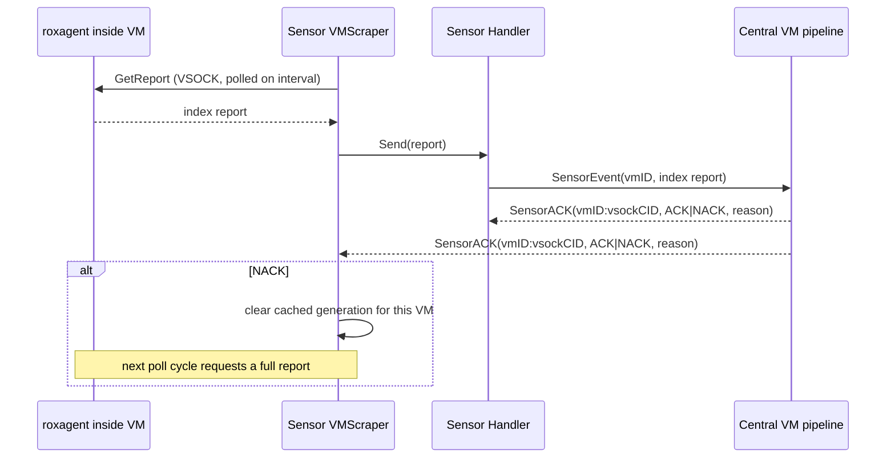

# ACK Model for VM Index Reports

VM index reports flow directly from Sensor to Central; Compliance is not involved (see `compliance/ACK_MODEL.md` for the separate node-scanning ACK model, which does go through Compliance).

`VMScraper` polls each VM's roxagent directly over VSOCK on a fixed interval (`ROX_VIRTUAL_MACHINES_SCRAPER_POLL_INTERVAL`) and forwards successful reports to Central through `vmIndex.Handler`, the same handler used by every other producer of `v1.IndexReport`s.

Central's `SensorACK` is not routed point-to-point back through the producer: Sensor delivers each `MsgToSensor` to every registered component whose `Accepts()` matches, so `Handler` and `VMScraper` independently receive the same ACK broadcast - `Handler` never forwards it to `VMScraper`.

`Handler`'s copy of the ACK only feeds a Prometheus counter for aggregate ACK/NACK observability - it does not drive any retry behavior. There is no separate retry/backoff loop and no payload cache: because Sensor re-polls every VM on a fixed interval regardless of ACK outcome, a NACK only needs to reset `VMScraper`'s cached `report_generation` so the next poll re-sends a full report instead of an "unchanged" delta.

## Why the resource ID is `vmID:vsockCID`

Using only the vsock CID is unsafe because a CID can be reused by a different VM later, so a stale ACK could otherwise get attributed to the wrong VM's report. Pairing it with `vmID` removes that ambiguity when parsing logs or correlating an ACK back to a specific VM and connection.

`VMScraper`'s own NACK handling only needs the `vmID` half - it extracts that portion (`vmIDFromResourceID`) and looks the VM up by ID in its own store; the CID is not used for VSOCK routing on this path. It stays in the pair purely for debugging/observability, not because pull mode's retry logic requires it.

One limitation remains: `vmID:vsockCID` is not a per-report unique ID - multiple in-flight reports from the same VM with the same CID are still not fully distinguishable, so a stale ACK can match the latest entry instead of the one it was actually for.
