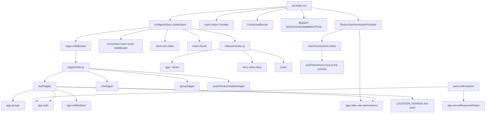

# Redux and redux-saga removal assessment

Assessment of the ACS console UI (`ui/apps/platform`) against git `master` tip `63f1561240389adc486e0a2aa31ef43a72c73329`. No product runtime code was changed.

Redux is no longer the application store. It is a legacy island around authentication, auth-provider administration, and a handful of shell concerns (toasts, server-reachability banner, Central capability flags, invite-modal visibility). Feature pages already load data with Apollo, `useRestQuery` / `useRestMutation`, Formik, URL state, and React context. There is no Redux Toolkit (`createSlice` / `configureStore` / `@reduxjs/toolkit`) anywhere under `ui/`.

## 1. Executive summary

| Fact | Count |
| --- | --- |
| App reducers under `app` | 9 (`auth`, `invite`, `notifications`, `roles`, `searchAutoComplete`, `serverResponseStatus`, `loading`, `groups`, `centralCapabilities`) |
| Extra root reducers | `router` (`connected-react-router`), `form` (`redux-form`) |
| Saga modules forked from the root saga | 4 (`auth`, `roles`, `groups`, `searchAutocomplete`) |
| Thunks | 1 (`fetchCentralCapabilitiesThunk`) |
| Files importing `react-redux`, `reselect`, `redux-form`, or `redux-saga` | about 40, almost all under `src/reducers`, `src/sagas`, login, access control, and shell chrome |
| `usePermissions` call sites (fed by Redux today in the standalone app) | ~94 files |
| `useRestQuery` files | ~80 |
| Files importing `@apollo/client` | ~172 |
| Formik files | ~99 |
| OpenShift console plugin Redux store | none (`ConsolePlugin/PluginProvider.tsx` does not mount a store) |

Rough effort shape: twelve independently shippable phases, easy and low-coupling first. Phases 1–4 are dead or leaf UI state and can start immediately. Phases 5–8 replace isolated shell slices with context or existing toast/form patterns. Phases 9–11 are the access-control and auth-session core and should not be parallelized. Phase 12 deletes the store, middleware, and npm dependencies.

Implementation size of the island (non-test): about 920 lines of reducers, about 660 lines of sagas, plus `src/init/configureStore.js` (50), `src/utils/sagaEffects.js` (69), and `src/utils/fetchingReduxRoutines.ts` (99). Tests that exist today are narrow: `src/sagas/authSagas.test.js`, `src/reducers/roles.test.js`, `src/reducers/notifications.test.js`, `src/reducers/serverResponseStatus.test.js`.

Policy already points this direction:

- `ui/AGENTS.md` state-management hierarchy: component state, props, context, and “only modify existing Redux — never add new Redux.”
- `ui/apps/platform/eslint.config.js` marks `src/reducers/**` and `src/sagas/**` deprecated and errors on new `connect` / `reselect` imports outside an explicit allowlist (`limited/no-non-deprecated-connect`, `limited/no-non-deprecated-reselect`).

## 2. Current architecture

Prose map:

1. `src/index.tsx` creates a `history` v4 browser history, `configureStore(undefined, history)`, and renders `Provider` → `ApolloProvider` → `ConnectedRouter` → `CompatRouter` → feature-flag and other context providers. `ReduxUserPermissionProvider` sits inside that tree and is the standalone source for `usePermissions`.
2. `src/init/configureStore.js` uses classic `createStore` + `applyMiddleware`. Middleware order: saga, `routerMiddleware`, `raven-for-redux` (state stripped from Sentry payloads), `redux-thunk`. After the store exists it registers two axios side effects: auth HTTP errors dispatch `auth/AUTH_HTTP_ERROR`, and 502–504 / network failures dispatch `serverStatus/RESPONSE_*`. Then `sagaMiddleware.run(rootSaga)`.
3. `src/reducers/index.js` combines `router`, `form`, and `app`. Selectors are bound with `utils/bindSelectors.js` so UI code calls `selectors.getX` from `reducers` and receives root state.
4. The root saga (`src/sagas/index.js`) forks four watchers. Nothing else registers sagas.
5. The OpenShift console plugin (`src/ConsolePlugin/PluginProvider.tsx`) already uses the replacement stack: Apollo plus `UserPermissionProvider` (`useRestQuery(fetchUserRolePermissions)`), `MetadataProvider`, feature flags, and public config. It does not import Redux.

`app.router` is never read by a selector. It exists so auth sagas can `take(LOCATION_CHANGE)` and `put(push(...))`. `app.form` is read only by `LoginPage.jsx` via `formValueSelector`.

## 3. Inventory

### 3.1 Dependencies

Only `ui/apps/platform/package.json` declares these libraries. `ui/package.json` is a deprecated wrapper with no Redux deps. No other package under `ui/` has its own `package.json`.

| Package | Where | Role |
| --- | --- | --- |
| `redux` ^4.1.2 | dependencies | `createStore`, `combineReducers` |
| `react-redux` ^7.2.6 | dependencies | `Provider`, `connect`, `useSelector`, `useDispatch` |
| `redux-saga` ^0.16.0 | dependencies | Saga 0.16 (`import { delay } from 'redux-saga'`, not `@redux-saga/core`) |
| `redux-thunk` ^2.4.1 | dependencies | Central capabilities thunk only |
| `redux-form` ^8.3.10 | dependencies | Login form only |
| `reselect` ^4.1.2 | dependencies | `createStructuredSelector` / one `createSelector` |
| `connected-react-router` ^6.9.3 | dependencies | Router state, `LOCATION_CHANGE`, `push`. Override forces React 18 |
| `raven-for-redux` ^1.3.1 | dependencies | Sentry middleware; state transformer returns `null` |
| `@types/react-redux` ^7.1.34 | devDependencies | Types |
| `redux-saga-test-plan` ^3.7.0 | devDependencies | `authSagas.test.js` |
| `redux-immutable-state-invariant` ^2.1.0 | devDependencies | **No imports.** Dead dependency |

Not present: `@reduxjs/toolkit`, `rematch`, `redux-observable`, `redux-first-history` (commented import in `src/index.tsx` and `src/utils/sagaEffects.js` only).

`@openshift-console/dynamic-plugin-sdk` bundles its own nested `redux-thunk`. That is not the app store. Do not treat it as a removal target.

### 3.2 Store setup

| Piece | Path |
| --- | --- |
| Store factory | `ui/apps/platform/src/init/configureStore.js` |
| Root reducer | `ui/apps/platform/src/reducers/index.js` |
| Root saga | `ui/apps/platform/src/sagas/index.js` |
| Provider, `ConnectedRouter`, capabilities dispatch | `ui/apps/platform/src/index.tsx` |
| Dummy store for component tests | `ui/apps/platform/src/test-utils/ComponentTestProvider.tsx` (`createStore(() => ({}), {})`) |
| Unused RTL helper | `ui/apps/platform/src/test-utils/renderWithRedux.jsx` (no callers; eslint says delete it) |
| Fetching action helper | `ui/apps/platform/src/utils/fetchingReduxRoutines.ts` |
| Location saga helpers | `ui/apps/platform/src/utils/sagaEffects.js` (`takeEveryLocation` used; `takeEveryNewlyMatchedLocation` unused) |

Style: classic `createStore` / `combineReducers`. No `createSlice`.

### 3.3 Reducers

All slices use `combineReducers` and hand-written action constants. Sizes are file line counts, including actions and selectors in the same module.

| Slice key | Path | LOC | State owned | Style | Notes |
| --- | --- | --- | --- | --- | --- |
| `auth` | `src/reducers/auth.js` | 223 | Login/session status, current user, login auth providers, admin auth providers, selected provider, editing flag, save status, IdP error, test-login results, available provider types | classic | Hottest slice. Several fields are written by sagas and not read by UI (see dead section) |
| `roles` | `src/reducers/roles.js` | 161 | Role list, selected role, **current user's permission map**, load/error flags. Also exports `getHasReadPermission` helpers used only by `roles.test.js` | classic | Permission map is the wide consumer. Role CRUD state is unused by UI |
| `centralCapabilities` | `src/reducers/centralCapabilities.ts` | 95 | `CentralServicesCapabilities`, error, `isLoading` (initial `true`) | classic + **thunk** | Fetched once from `index.tsx`. No saga |
| `serverResponseStatus` | `src/reducers/serverResponseStatus.ts` | 96 | Successive 502–504 failure count and `UP` / `UNREACHABLE` / `RESURRECTED` | classic | Updated from axios on every response. Reducer comment: return the same state object on the happy path or React re-renders the shell |
| `groups` | `src/reducers/groups.js` | 71 | Rule groups and a derived map by auth provider id | classic | Map is only `select`ed inside `groupSagas.js` |
| `notifications` | `src/reducers/notifications.ts` | 59 | String queue | classic | Render path calls `react-toastify` `toast()` |
| `searchAutoComplete` | `src/reducers/searchAutocomplete.js` | 57 | Autocomplete results and “all search options” | classic | Writes have no readers |
| `invite` | `src/reducers/invite.ts` | 48 | `showInviteModal` boolean | classic | UI flag, no server data |
| `loading` | `src/reducers/loading.js` | 39 | Map of in-flight `*_REQUEST` actions | classic | Only auth-provider page reads it |
| `form` | redux-form reducer, wired in `reducers/index.js` | — | Login form values | library | Single form id `login-form` |
| `router` | `connectRouter(history)` | — | History location | library | No selector reads it |

### 3.4 Sagas

| Watcher | Path | LOC | Effects | Reducer coupling |
| --- | --- | --- | --- | --- |
| `auth` | `src/sagas/authSagas.js` | 444 | On first `LOCATION_CHANGE`: handle `/auth/response/:type` (OIDC, generic, test login, roxctl authorize) or else fetch login providers and user permissions. `takeEveryLocation('/login')` stores the requested URL and redirects anonymous users. Logout calls `AuthService.logout`. `AUTH_HTTP_ERROR` from the axios interceptor logs the user out on non-403. Save/delete auth provider calls `AuthService` then `groups` actions. Fetches available provider types at startup. `put(push(...))` restores the post-login path (with a `delay(10)` workaround for a `LOCATION_CHANGE` bug) | `auth`, `roles.fetchUserRolePermissions`, `groups.saveRuleGroup`, `notifications`, router |
| `roles` | `src/sagas/roleSagas.js` | 86 | `FETCH_ROLES` → `RolesService.fetchRoles`. `SAVE_ROLE` / `DELETE_ROLE` / `SELECTED_ROLE` call create/update/delete and toast on error | `roles`, `notifications` |
| `groups` | `src/sagas/groupSagas.js` | 93 | `FETCH_RULE_GROUPS` → `GroupsService.fetchGroups`. `SAVE_RULE_GROUP` updates groups then sets auth save status. `DELETE_RULE_GROUP` deletes one group | `groups`, `auth` save status / editing flag |
| `searchAutocomplete` | `src/sagas/searchAutocompleteSagas.js` | 24 | `take(SEND_AUTOCOMPLETE_REQUEST)` → `SearchService.fetchAutoCompleteResults` | `searchAutocomplete` |

`takeEveryNewlyMatchedLocation` in `src/utils/sagaEffects.js` has no callers.

Thunk (not a saga): `fetchCentralCapabilitiesThunk` in `src/reducers/centralCapabilities.ts` calls `services/MetadataService.fetchCentralCapabilities` once at startup.

### 3.5 Consumers

Hotspot means many files or a shell-wide gate. Leaf means a handful of screens.

| Slice | Readers | Writers | Shape |
| --- | --- | --- | --- |
| `roles.userRolePermissions` | `ReduxUserPermissionProvider` → `usePermissions` in ~94 files (nav, every major route) | `authSagas.getUserPermissions` only | **Hotspot / shell gate** |
| `auth.authStatus` | `AuthenticatedRoutes.tsx` (gates the entire authenticated shell), `LoginPage.jsx` | `authSagas` login/logout/anonymous/provider fetch failure | **Hotspot / shell gate** |
| `auth.currentUser` | `hooks/useAuthStatus.ts` (12 live files: clusters table, init bundles, cluster registration secrets, vuln report jobs, exception request, compliance schedules), `UserMenu.tsx`, `UserPage.jsx`, `AuthProvidersList.tsx` | `auth/LOGIN` | **Hotspot, read-mostly** |
| `centralCapabilities` | `hooks/useCentralCapabilities.ts` (integrations pages, ECR form, system health, `Banners.tsx`); `MainPage.tsx` blocks first paint on `getIsLoadingCentralCapabilities` | startup thunk | **Shell gate + integrations** |
| `serverResponseStatus` | `ServerStatusBanner.tsx`, `DatabaseStatusBanner.tsx` (shell banners on every page) | axios interceptor in `configureStore.js` via `services/serverErrorHandler.js` | **Shell chrome, hot write path** |
| `notifications` | `Header/Notifications.tsx` | `CLIDownloadMenu.tsx`, `Clusters/DownloadHelmValues.tsx`, `Compliance/ScanButton.jsx`, `VulnMgmt/List/Cves/VulnMgmtListCves.jsx`, plus `put`s in `authSagas` and `roleSagas` | **Leaf writers, global reader** |
| `invite` | `Body.tsx` (mounts modal), `InviteUsersModal.tsx` | `UserMenu.tsx`, `AuthProviders.tsx`, modal close | **Leaf** |
| `auth` providers / save status / types | `AuthProviders.tsx`, `AuthProviderForm.tsx`, `AuthProvidersList.tsx`, `InviteUsersModal.tsx`, `LoginPage.jsx` (login providers and IdP error), `TestLoginResultsPage.jsx` | those screens' dispatches and `authSagas` | **Access Control + login** |
| `roles` list | `AuthProviderForm.tsx`, `InviteUsersModal.tsx` via `selectors.getRoles` | `FETCH_ROLES` from those screens and `roleSagas` | **Leaf.** Access Control **Roles** page does **not** use this slice |
| `groups` | `AuthProviders.tsx`, `AuthProviderForm.tsx`, `InviteUsersModal.tsx` | fetch from those screens; save from `authSagas` | **Leaf, coupled to auth-provider save** |
| `loading` | `AuthProviders.tsx` only (`FETCH_AUTH_PROVIDERS`, `FETCH_ROLES`) | any `*_REQUEST` / `*_SUCCESS` / `*_FAILURE` action, generically | **Leaf** |
| `form` | `LoginPage.jsx` only | redux-form | **Leaf** |
| `searchAutoComplete` | none | `URLSearchInputWithAutocomplete.jsx` dispatches `setAllSearchOptions`; saga would write results if `SEND_AUTOCOMPLETE_REQUEST` fired | **Dead** |
| `router` | none | `connected-react-router` | **Infrastructure for sagas** |

`connect` allowlist (eslint ignores) matches the files that still import `connect`: auth-provider trio, `DownloadHelmValues.tsx`, login pages, `AuthenticatedRoutes.tsx`, `CLIDownloadMenu.tsx`, `UserMenu.tsx`, `InviteUsersModal.tsx`, `ReduxUserPermissionProvider.tsx`, `UserPage.jsx`, `useAuthStatus.ts`, everything under `Components/`, `Compliance/`, and `VulnMgmt/`. Additional `useSelector` call sites that the `connect` rule does not flag: `useCentralCapabilities.ts`, `MainPage.tsx`, `Body.tsx`, `Notifications.tsx`, `ServerStatusBanner.tsx`, `DatabaseStatusBanner.tsx`.

### 3.6 Replacement patterns already in the tree

Prefer these. Do not introduce a new global client store.

| Concern | Existing pattern | Example |
| --- | --- | --- |
| REST reads | `useRestQuery` | `src/hooks/useRestQuery.ts`; collections, clusters, VM CVEs, system config |
| REST writes | `useRestMutation` | documented in `ui/AGENTS.md` |
| GraphQL | Apollo `useQuery` | config management, risk timelines, cluster health counter |
| Search autocomplete | local state + Apollo, or `SearchService.fetchAutoCompleteResults` inside the component | `Components/URLSearchInput.jsx` (Apollo `searchAutocomplete` query), `Components/SearchFilterInput/SearchFilterInput.tsx` (REST, explicitly “replacement for ReduxSearchInput or URLSearchInput”) |
| Permissions in the plugin | `UserPermissionProvider` + `useRestQuery(fetchUserRolePermissions)` + `usePermissions` | `src/providers/UserPermissionProvider.tsx` |
| Metadata polling | `MetadataProvider` + context | `src/providers/MetadataProvider.tsx` |
| Feature flags, public config, telemetry, lightspeed | context providers in `src/providers/` | already wrapped in `index.tsx` |
| Toasts on modern pages | `hooks/patternfly/useToasts` | policies, collections, integrations list, vuln reporting, exception config |
| Forms | Formik (~99 files) | auth-provider form still uses custom state; login is the last redux-form |
| Access Control roles / permission sets / access scopes | direct `RolesService` calls, not Redux | `Containers/AccessControl/Roles/Roles.tsx` |
| Route and filter state | `useURLParameter`, `useURLPagination`, `useURLSort` | widespread |

`SearchFilterInput.tsx` already calls `fetchAutoCompleteResults` and keeps suggestions in `useState`. The saga path is the old one.

### 3.7 Dead or near-dead Redux

Safe to delete once a quick “no remaining dispatch” check is repeated on the branch you cut from:

| Item | Why it is dead or near-dead |
| --- | --- |
| `searchAutocomplete` reducer + `searchAutocompleteSagas.js` | `SEND_AUTOCOMPLETE_REQUEST`, `clearAutoComplete`, and `recordAutoCompleteResponse` are never dispatched from UI. `SearchInput.jsx` can call them only if a parent passes the props. `SearchFilterInput` does not. `getAutoCompleteResults` and `getAllSearchOptions` have no readers. `URLSearchInputWithAutocomplete` still `connect`s `setAllSearchOptions`, which writes state nobody reads |
| `takeEveryNewlyMatchedLocation` | exported, never called |
| `roleSagas` `SAVE_ROLE`, `DELETE_ROLE`, `SELECTED_ROLE` | no UI dispatch. Roles UI calls `RolesService.deleteRole` / `fetchRolesAsArray` directly. `selectors.getSelectedRole` has no readers. `getUserRolePermissionsError` has no readers |
| `groupSagas` `DELETE_RULE_GROUP` | action creator exists; no dispatch. `selectors.getGroupsByAuthProviderId` is only read inside the save saga |
| `auth.selectedAuthProvider`, `auth.isEditingAuthProvider` | saga writes them. UI selects the provider from the route (`AuthProviders.tsx` `entityId`), and `getSelectedAuthProvider` / `getAuthProviderEditingState` have no component readers |
| `getCentralCapabilitiesError` | selector exported, never used. Failures leave capabilities as `{}`, and `useCentralCapabilities` treats anything other than `'CapabilityDisabled'` as available |
| `redux-immutable-state-invariant` | devDependency, zero imports |
| `renderWithRedux.jsx` | zero callers |
| Empty `connect()` | `Components/IconWidget.jsx`, `CountWidget.jsx`, `InfoWidget.jsx` call `connect()` with no state and no dispatch. Used by deprecated compliance entity widgets |
| Saga notification `put`s that add and immediately remove | `authSagas` delete-provider and provider-type errors, and `roleSagas` save/delete errors, `put(addNotification)` then `put(removeOldestNotification)` with no `delay`. `Notifications.tsx` only calls `toast()` when the queue is non-empty during render. Confirm in the browser whether those errors still appear; they may already be invisible. Component callers (`CLIDownloadMenu`, helm download, scan, CVE snooze) use `setTimeout` before remove and are the live toast paths |

`fetchingReduxRoutines.ts` stays until `auth`, `roles`, and `groups` request/success/failure actions are gone. `loading.js` becomes unused as soon as `AuthProviders.tsx` stops reading it.

## 4. Phased plan

Each phase ships with no intended behavior change. Do the next phase only after the previous exit criteria for its blockers are met. Phases 1–4 have no blockers.

### Phase 1 — Remove dead search-autocomplete Redux

- **Scope:** `src/reducers/searchAutocomplete.js`; drop `searchAutoComplete` from `src/reducers/index.js`; `src/sagas/searchAutocompleteSagas.js`; drop its `fork` from `src/sagas/index.js`; stop dispatching `setAllSearchOptions` from `src/Components/URLSearchInputWithAutocomplete.jsx` (delete the `connect` wrapper). Leave `SearchInput.jsx` props in place until a parent still passes them — today none do — or delete the unused prop plumbing in the same change if call sites stay empty.
- **Why this order:** No reader. Autocomplete that users see already goes through Apollo in `URLSearchInput.jsx` or REST in `SearchFilterInput.tsx`.
- **Replacement:** none for the Redux slice. Keep the Apollo and `SearchFilterInput` paths as they are.
- **Dependencies / blockers:** none.
- **Risk:** Low. The only behavior to preserve is that dispatching a leftover `setAllSearchOptions` must not be required for suggestions to appear.
- **Verification:** see the proof template. Programmatic: unit tests around `src/utils/searchUtils.test.ts` if touched; Cypress component `CompoundSearchFilter.cy.jsx` is Apollo autocomplete and should stay green; no saga test covers this file. Behavioral: search boxes on deprecated config-management lists (`Containers/ConfigManagement/List/*` via `URLSearchInput`), compliance search (`ComplianceSearchInput.jsx`), vuln-mgmt entity list (`VulnMgmt/List/EntityList.jsx`), and live search on Risk, Search, and Network Graph (`SearchFilterInput`). Visual: those search dropdowns in the console chrome, not a harness alone. Data parity: suggestion lists for one category query before and after (network response unchanged; Redux state for `searchAutoComplete` should be absent). Exit: no imports of `reducers/searchAutocomplete` or `sagas/searchAutocompleteSagas`; root saga and root reducer no longer mention them.

### Phase 2 — Drop empty `connect()` wrappers

- **Scope:** `src/Components/IconWidget.jsx`, `CountWidget.jsx`, `InfoWidget.jsx`. Export the components directly.
- **Why this order:** They do not read or write state. The wrappers only exist to satisfy `react-redux`. Independent of every slice.
- **Replacement:** plain function components. No new state.
- **Dependencies / blockers:** none. Can ship in parallel with phase 1.
- **Risk:** Low. Call sites are deprecated compliance entity pages (`Containers/Compliance/Entity/Namespace.jsx`, `Deployment.jsx`, `Node.jsx`, `widgets/ResourceCount.jsx`).
- **Verification:** Programmatic: `npm run lint:fast-dev` on the three files; no unit tests. Behavioral: compliance entity pages still render count and info widgets. Visual: a compliance entity route in the real console (legacy compliance chrome). Data parity: not a data slice. Exit: those files do not import `react-redux`.

### Phase 3 — Delete unused role-mutation and group-delete watchers

- **Scope:** In `src/sagas/roleSagas.js`, remove `saveRole`, `deleteRole`, `selectRole` and their `takeLatest`s. Keep `FETCH_ROLES`. In `src/reducers/roles.js`, remove `SAVE_ROLE`, `DELETE_ROLE`, `SELECTED_ROLE` actions and the `selectedRole` sub-reducer if a repo-wide search still shows no readers. In `src/sagas/groupSagas.js` and `src/reducers/groups.js`, remove `DELETE_RULE_GROUP` only. Do not remove `SAVE_RULE_GROUP` (auth saga still `put`s it).
- **Why this order:** Watchers with no dispatchers. Access Control roles already use `RolesService` (`Roles.tsx`). Shrinking the saga surface makes phase 9 smaller.
- **Replacement:** already done for roles CRUD. Group delete, if a UI still needs it, already has `GroupsService.deleteRuleGroup` and is not wired through Redux.
- **Dependencies / blockers:** re-grep `roleActions.saveRole`, `deleteRole`, `selectRole`, and `deleteRuleGroup` dispatches immediately before the change.
- **Risk:** Low, as long as `FETCH_ROLES` and `SAVE_RULE_GROUP` stay. `roles.test.js` only covers initial state and permission helpers; update the initial-state expectation if `selectedRole` is removed.
- **Verification:** Programmatic: `npm run test -- src/reducers/roles.test.js` and `src/sagas/authSagas.test.js` (auth saga still forks group save). Cypress: `cypress/integration/accessControl/accessControlRoles.test.js` and `accessControlAuthProviders.test.js`. Behavioral: Access Control roles list/create/delete and auth-provider save. Visual: `/main/access-control` roles and auth providers in the console. Data parity: role list and group rules from the API, not from Redux, before and after a save. Exit: no remaining `SAVE_ROLE` / `DELETE_ROLE` / `SELECTED_ROLE` / `DELETE_RULE_GROUP` types; fetch and auth-provider save still work.

### Phase 4 — Invite-modal visibility to local state

- **Scope:** `src/reducers/invite.ts`; remove `invite` from the root reducer. Call sites: `src/Containers/MainPage/Body.tsx`, `Header/UserMenu.tsx`, `InviteUsers/InviteUsersModal.tsx`, `Containers/AccessControl/AuthProviders/AuthProviders.tsx`.
- **Why this order:** One boolean. No saga. No server cache. The modal can keep dispatching auth-provider, role, and group fetches until phase 9.
- **Replacement:** `useState` in `Body` (or a tiny context if `UserMenu` and `AuthProviders` cannot receive a callback without painful drilling). `UserMenu` and `AuthProviders` call `onOpenInvite()`. `InviteUsersModal` receives `isOpen` and `onClose`. Do not put this flag in the URL.
- **Dependencies / blockers:** none. Phase 9 later deletes the fetches inside the modal; this phase must not wait for that.
- **Risk:** Low. Two entry points open the same modal (user menu and auth providers). Both must still open it, and Access write permission must still hide it (`Body.tsx` `hasReadWriteAccess('Access')`).
- **Verification:** Programmatic: `src/Containers/MainPage/InviteUsers/InviteUsers.utils.test.ts` if helpers change; no saga test. Behavioral: open and close Invite users from the user menu and from Access Control auth providers; submit still calls the existing invite API. Visual: header user menu and `/main/access-control` auth providers, modal over the real shell. Data parity: invite request payload unchanged. Exit: no imports of `reducers/invite`.

### Phase 5 — Central capabilities to a context provider

- **Scope:** `src/reducers/centralCapabilities.ts`; remove `centralCapabilities` from the root reducer; remove the thunk dispatch and `redux-thunk` cast from `src/index.tsx`; rewrite `src/hooks/useCentralCapabilities.ts`; drop the `useSelector` in `src/Containers/MainPage/MainPage.tsx`.
- **Why this order:** One startup GET, no saga, no cross-slice writes. `MetadataProvider` is the in-repo template (`useRestQuery` + context + stable reference). The plugin does not use this slice, so plugin behavior stays put.
- **Replacement:** `CentralCapabilitiesProvider` next to `MetadataProvider`, implemented with `useRestQuery(fetchCentralCapabilities)`. Keep `isLoading` true until the first settle so `MainPage` does not flash routes that depend on flags. `useCentralCapabilities` keeps the same function shape: missing or non-`CapabilityDisabled` means available (current reducer starts as `{}` and the hook returns true unless the flag is `'CapabilityDisabled'`). Preserve that default on error so a failed metadata call does not hide integrations.
- **Dependencies / blockers:** none. `redux-thunk` can leave `package.json` in this phase only if no other thunk remains (there is not). Prefer deleting the dependency here.
- **Risk:** Medium. `MainPage` waits on the loading flag before rendering the shell, and integrations / system health / certificate banner hide features from these flags.
- **Verification:** Programmatic: add a unit test for the availability helper (disabled vs missing vs enabled); `npm run tsc` or IDE diagnostics on the provider. Cypress: integrations tests if present, plus system health if covered. Behavioral: `/main/integrations` (notifier tab and ECR form), `/main/system-health`, and the certificate banner when `centralCanUpdateCert` is on or off. Visual: those routes in the console, including the first paint (no stuck “loading capabilities” and no flash of hidden tiles). Data parity: `GET` capabilities response vs what `isCentralCapabilityAvailable` returns for each known flag, including the error path. Exit: no `metadata/FETCH_CENTRAL_CAPABILITIES_*` actions; `redux-thunk` removed from `package.json` and `configureStore.js` if this was the last thunk.

### Phase 6 — Server reachability out of Redux

- **Scope:** `src/reducers/serverResponseStatus.ts` and its test; selector wiring in `reducers/index.js`; dispatches in `configureStore.js`; readers `ServerStatusBanner.tsx` and `DatabaseStatusBanner.tsx`.
- **Why this order:** Two banners, no saga, no other slice. Do it after capabilities so shell-loading changes are not stacked in one release. The reducer is small but the write path is every axios response.
- **Replacement:** a small context or external store updated by the existing `registerServerErrorHandler` callbacks. Move the threshold constants (`5` failures and `15` seconds) with the logic. Keep the “same snapshot if nothing changed” behavior so successful responses do not re-render the shell. `DatabaseStatusBanner` should keep its own `fetchDatabaseStatus` poll; it only consults Redux to suppress itself while the server is `UNREACHABLE`.
- **Dependencies / blockers:** none relative to auth. Do not rewrite the axios client in this phase.
- **Risk:** Medium. Wrong batching or a new object on every 200 will re-render the page shell. Threshold mistakes will flash the red banner or hide a real outage.
- **Verification:** Programmatic: keep and retarget `src/reducers/serverResponseStatus.test.js` (thresholds: under 5 failures, under 15 seconds, both exceeded, resurrection). Behavioral: normal navigation does not show a banner; simulate 502s (browser devtools or a proxy) until the red banner; recover and see the green “reachable again” banner; database banner still polls. Visual: banner in the real header/page chrome, not a component mount alone. Data parity: the status string (`''`, `UP`, `UNREACHABLE`, `RESURRECTED`) for the scripted failure sequences in the unit test. Exit: no `serverStatus/RESPONSE_*` dispatches; banners read the new provider.

### Phase 7 — Notification queue to the existing toast hook

- **Scope:** `src/reducers/notifications.ts`, `notifications.test.js`, `Header/Notifications.tsx` (the redux subscription; keep `ToastContainer` if `useToasts` still needs it — read `hooks/patternfly/useToasts.tsx` and follow that hook), writers `CLIDownloadMenu.tsx`, `DownloadHelmValues.tsx`, `Compliance/ScanButton.jsx`, `VulnMgmt/List/Cves/VulnMgmtListCves.jsx`, and the `put(notificationActions.*)` sites in `authSagas.js` and `roleSagas.js`.
- **Why this order:** The queue is a side channel, but sagas still `put` into it. Doing it after phase 3 means role-mutation toasts may already be gone. Doing it before phase 11 means auth-saga errors need a non-hook API.
- **Replacement:** `useToasts` for React callers. For the saga, a tiny imperative helper the toast provider registers (module listener), or inline `toast()` from `react-toastify` at the saga `catch` if that matches current `Notifications.tsx`. Do not keep a Redux queue “just for sagas.” Confirm the add-then-immediate-remove saga path (section 3.7) and preserve whatever is actually visible.
- **Dependencies / blockers:** phase 3 if you want role-saga toast puts to disappear first. Not blocked by auth removal.
- **Risk:** Medium. CLI download, Helm values download, legacy compliance scan, and legacy vuln-mgmt CVE actions are the user-visible toasts. Losing auth-provider delete errors would be a regression if those toasts do show today.
- **Verification:** Programmatic: `hooks/patternfly/useToasts.test.ts`; retarget or delete `notifications.test.js`. Behavioral: user-menu CLI download failure toast; cluster Helm values download failure (`DownloadHelmValues`); legacy compliance scan button; legacy vuln-mgmt CVE list toast; auth-provider delete failure if the saga toast is real. Visual: toast in the console shell (header `ToastContainer`), including CLI menu in the masthead. Data parity: toast text matches the previous string (including the Helm error interpolation). Exit: no imports of `reducers/notifications`.

### Phase 8 — Login form off redux-form

- **Scope:** `redux-form` usage in `src/Containers/Login/LoginPage.jsx`; `src/Components/forms/ReduxSelectField.jsx`, `ReduxTextField.jsx`, `ReduxPasswordField.jsx`; `src/constants/reduxFormPropTypes.js` if unused after that; `form` reducer in `reducers/index.js`.
- **Why this order:** The form library is isolated to login, but login still **reads** `auth` for providers, auth status, and IdP error. Remove the form library without rewriting the session saga.
- **Replacement:** local component state or Formik (already the common form library). Keep `useSelector` / `connect` for `getLoginAuthProviders`, `getAuthStatus`, and `getAuthProviderError` until phase 11. `LoadingOrForm` must still wait until providers exist before mounting fields, so the first provider stays selected.
- **Dependencies / blockers:** none for the form library. Eslint comment says “rewrite pending PatternFly 6”; a behavior-preserving control change does not require a visual redesign. Do not block on a PatternFly upgrade.
- **Risk:** Medium. This is the login screen, including basic auth and the roxctl-authorize mode that filters out the `basic` provider.
- **Verification:** Programmatic: no login unit test exists; add a pure test for “initial provider” and “roxctl mode filters basic” if that logic is extracted. Cypress: `cypress/integration/productBranding.test.js` visits `/login`; `cypress/integration/auth.test.js` is `describe.skip` and is not proof until unskipped or replaced. Behavioral: `/login` provider select, basic username/password submit, SSO link, loading state before providers arrive, roxctl authorize query. Visual: `/login` in the real console, not a form harness. Data parity: the submit payload and chosen provider id match the previous form values. Exit: no `redux-form` import; `form` key gone from the root reducer; `redux-form` removed from `package.json`.

### Phase 9 — Auth-provider administration, groups, role list, and loading flags

- **Scope:** `src/reducers/groups.js`, `src/sagas/groupSagas.js`, `src/reducers/loading.js`; role **list** actions in `src/reducers/roles.js` and `FETCH_ROLES` in `src/sagas/roleSagas.js` (leave `userRolePermissions` for phase 10); auth-provider CRUD state in `src/reducers/auth.js` and the save/delete/fetch watchers in `src/sagas/authSagas.js` (`saveAuthProvider`, `deleteAuthProvider`, `getAuthProviders`, `fetchAvailableProviderTypes` if only the admin page needs it). UI: `AuthProviders.tsx`, `AuthProviderForm.tsx`, `AuthProvidersList.tsx`, and the data fetches inside `InviteUsersModal.tsx`.
- **Why this order:** Access Control roles, permission sets, and access scopes already call services directly. This phase makes auth providers match that. It is larger than phases 1–8 because save currently orchestrates provider create/update **and** rule groups inside the saga, including immutable-provider checks.
- **Replacement:** `useRestQuery` / `useRestMutation` (or plain promises, as `Roles.tsx` does) against `AuthService`, `GroupsService`, and `RolesService.fetchRolesAsArray`. Own loading and save-error state in the page. Move the saga’s save sequence into a function next to the form: create or update provider, then `updateOrAddGroup` with the same `permissionRuleGroupUtils` rules. Keep login-provider fetch, current user, auth status, test-login results, and the HTTP-error watcher in Redux until phase 11.
- **Dependencies / blockers:** phase 3 (dead watchers) and phase 4 (invite flag) so this diff does not mix them. Phase 7 if saga toasts moved; otherwise keep a temporary toast call in the new save/delete catch. Does not require phase 10.
- **Risk:** High. Auth-provider save is the subtle path: new vs existing, inactive immutable providers, default role, invalid rules, and the follow-up group write that today sets `setSaveAuthProviderStatus`. A mistake locks an admin out of editing IdPs. Cypress coverage exists and is the bar.
- **Verification:** Programmatic: `authSagas.test.js` will shrink; keep tests for the watchers that remain (login redirect, HTTP error). Cypress: `cypress/integration/accessControl/accessControlAuthProviders.test.js`, `accessControlOrigin.test.js`, `accessControlRoles.test.js` (must not regress). Behavioral: `/main/access-control` auth providers list, create, edit, rules, minimum role, delete, declarative/immutable providers, test-login button that opens `/test-login-results`, invite modal still listing providers/roles/groups. Visual: that route in the console, including empty state and save error alert. Data parity: `GET /v1/authProviders`, groups, and roles before and after save; the group payload must match `getGroupsWithDefault` output from today. Exit: no `reducers/groups`, no `sagas/groupSagas`, no `reducers/loading`, no `FETCH_ROLES`; auth saga file no longer handles save/delete provider; admin screens do not import those actions.

### Phase 10 — User permissions to the plugin’s provider, gated on auth

- **Scope:** `userRolePermissions`, `error`, and `isLoading` in `src/reducers/roles.js`; `getUserPermissions` in `src/sagas/authSagas.js`; `src/Containers/ReduxUserPermissionProvider.tsx`. After this, `src/sagas/roleSagas.js` and `src/reducers/roles.js` should be gone (phase 9 removed the list). `src/reducers/roles.test.js` permission-helper cases should move next to `usePermissions` or be deleted if `usePermissions` is the only implementation.
- **Why this order:** Widest read fan-out in the app. The plugin already has the replacement (`UserPermissionProvider`). Doing it before the rest of the auth saga lets the saga stop being the permission fetcher while login/logout still live in Redux.
- **Replacement:** Use `UserPermissionProvider` **only if** fetch timing matches the saga. Today the saga fetches permissions after the first location is known and again after a successful token exchange (`dispatchAuthResponse`). A mount-time `useRestQuery` can 401 before the token is stored. Gate the query on `authStatus` `LOGGED_IN` or `ANONYMOUS_ACCESS`, and refetch when that status flips (logout → login). Keep `isLoadingPermissions` true until the first success so nav does not flash “no access”. Initial reducer state is `isLoading: true` on purpose (`roles.js` comment).
- **Dependencies / blockers:** phase 9 if you want one roles deletion; technically permissions can move first, but then two roles migrations overlap. Do not start phase 11 until this provider is the only permissions source.
- **Risk:** High. `usePermissions` hides routes, sidebar entries, and buttons across the console. A default of “loaded, empty” hides the product. A default of “not loading” shows unauthorized actions.
- **Verification:** Programmatic: `roles.test.js` cases for read vs write vs replaced resources, pointed at whatever helper remains; `authSagas.test.js` login paths that currently expect `fetchUserRolePermissions`. Cypress: `cypress/integration/access.test.js` and a read-only role walk of sidebar items if that spec covers it. Behavioral: login as admin and as a read-only role; sidebar and `/main/access-control` write buttons; logout and login as the other user without a stale permission map. Visual: shell navigation in the console for both roles. Data parity: `fetchUserRolePermissions` response vs `hasReadAccess` / `hasReadWriteAccess` for several resources, including `replacedResourceMapping`. Exit: `ReduxUserPermissionProvider` deleted; `index.tsx` uses the gated provider; no `roles/FETCH_USER_ROLE_PERMISSIONS` actions; plugin provider behavior unchanged.

### Phase 11 — Auth session saga, current user, and router coupling

- **Scope:** remaining `src/reducers/auth.js`, remaining `src/sagas/authSagas.js`, `src/sagas/index.js`, `src/utils/sagaEffects.js`, `src/sagas/authSagas.test.js`, `src/sagas/sagaTestUtils.js`. UI: `AuthenticatedRoutes.tsx`, `LoginPage.jsx` (reads left from phase 8), `TestLoginResultsPage.jsx`, `UserMenu.tsx` logout and current user, `UserPage.jsx`, `hooks/useAuthStatus.ts`, `AuthProvidersList.tsx` current user if still on Redux. Router: `ConnectedRouter`, `connectRouter`, `routerMiddleware`, `push` / `LOCATION_CHANGE` from `connected-react-router`. Axios registration that today closes over `store.dispatch` (`configureStore.js` `handleAuthHttpError`).
- **Why this order:** Everything else is removable while this saga still boots the session. It owns token exchange, anonymous access, logout, post-login redirect, test login, and roxctl authorize (`window.location.assign` to the CLI callback). `connected-react-router` exists for this saga; do not remove it in an earlier phase.
- **Replacement:** an `AuthProvider` context (session status + current user) updated by plain async functions in `services/AuthService`, not by dispatched actions. Start the same bootstrap on first render: read the location, if it is under `authResponsePrefix` run the existing handlers, otherwise load login providers and permissions (phase 10 provider). Replace `put(push)` with `history.push` or `useNavigate` from `react-router-dom-v5-compat`, and keep the post-login redirect to the stored location. Replace `takeEveryLocation(loginPath)` with a `/login` route effect. Replace the axios auth interceptor with a direct call into the auth module (`services/AuthService` already has the interceptor hook). Test-login results can be route state or `sessionStorage` for `/test-login-results` only.
- **Dependencies / blockers:** phases 8, 9, and 10. Phase 7 if any auth error still goes through the notification slice.
- **Risk:** High. This is login, logout, session restore, IdP redirect, anonymous mode, and “return to the page you asked for.” The saga’s `delay(10)` is a workaround so `push` still emits `LOCATION_CHANGE`. A context rewrite should not depend on that workaround; it must still land on the stored path.
- **Verification:** Programmatic: port `authSagas.test.js` cases to tests of the new functions (login with valid token, invalid token, logout, 401 vs 403, login-page redirect storage, test-login vs real login vs roxctl). The skipped Cypress `auth.test.js` is not sufficient; extend it or add a focused spec and run it. Behavioral: cold load with a stored token lands in the app; cold load without a token lands on `/login` and returns to the deep link; basic login; SSO return through `/auth/response/...`; logout from the user menu; `/test-login-results`; roxctl central login callback; anonymous access when no providers exist; 401 from an API logs the user out. Visual: `/login`, the authenticated masthead (`UserMenu`), and `/main/user`. Data parity: `GET /v1/auth/status` user object shown in the user menu and user page equals the previous `currentUser`. Exit: no `reducers/auth`, no `sagas/`; no `connected-react-router` imports; `AuthenticatedRoutes` reads context.

### Phase 12 — Store teardown

- **Scope:** `src/init/configureStore.js`; `src/reducers/index.js` and `utils/bindSelectors.js` if unused; `Provider` and store construction in `src/index.tsx`; dummy store in `ComponentTestProvider.tsx`; `renderWithRedux.jsx`; eslint allowlists that only existed for `connect` / `reselect` / `src/reducers/**` / `src/sagas/**`; package entries listed in section 3.1 (`redux`, `react-redux`, `redux-saga`, `redux-thunk` if still present, `redux-form`, `reselect`, `connected-react-router`, `raven-for-redux`, `@types/react-redux`, `redux-saga-test-plan`, `redux-immutable-state-invariant`).
- **Why last:** Every earlier phase assumes `createStore` still runs. Removing `Provider` while a `useSelector` remains breaks the shell.
- **Replacement:** `index.tsx` renders the context providers directly. Router is the existing `react-router-dom` v5 `Router` (or `CompatRouter` alone, matching the comment in `index.tsx`). Sentry stays via `installRaven` / `raven-js`; only the Redux middleware goes. `ComponentTestProvider` drops `Provider`.
- **Dependencies / blockers:** phases 1–11 complete. `rg` for `react-redux`, `redux-saga`, `from 'redux'`, `reselect`, `redux-form`, `connected-react-router` under `ui/apps/platform/src` returns nothing.
- **Risk:** Medium mechanically, High if a stray `useSelector` remains. The plugin must still build (`npm run build:ocp-plugin`) because it never had this store.
- **Verification:** Programmatic: `npm run test` for unit tests that imported reducers; `npm run lint:fast-dev` on `src/index.tsx` and test-utils; `npm run build` and `npm run build:ocp-plugin` if CI time allows, otherwise `tsc`. Cypress component tests that use `ComponentTestProvider` (dashboard widgets, compound search, horizontal subnav). Behavioral: login and one page load of dashboard, violations, vulnerabilities, integrations, access control. Visual: dashboard shell after login. Data parity: not a data slice; confirm Redux DevTools no longer attaches. Exit: dependencies gone from `package.json` and the lockfile; no `Provider`; no saga middleware.

## 5. Proof template

Reuse this for every phase. A phase is not done on a green typecheck alone.

**Programmatic**

- From `ui/apps/platform`: `npm run test -- <the unit files this phase touched or listed above>`.
- Saga phases: `npm run test -- src/sagas/authSagas.test.js` until that file is deleted in phase 11.
- Lint: `npm run lint:fast-dev -- <changed files>` from `ui/apps/platform`.
- Do not add `@testing-library/react` component tests. Interaction coverage belongs in Cypress (`ui/AGENTS.md`).

**Behavioral**

- Exercise the routes named in that phase’s verification section against a real Central, or against Cypress intercepts when a spec already exists.
- Session phases must include logged-out, logged-in, and logout. Permission phases must include two roles.

**Visual**

- When the slice renders UI, prove it in the ACS console chrome: `npm run deploy-local` from `ui/`, then `npm run start` from `ui/` (proxies to the local cluster). A Cypress component mount or a single screenshot of an isolated component is not enough for shell banners, login, the masthead, or Access Control.
- Deprecated compliance and vuln-mgmt surfaces still count if the phase touches them (phases 2 and 7).

**Data parity**

- For server-derived slices (`auth` user and providers, roles, groups, capabilities, search suggestions): capture the relevant GET body and the UI projection (selected ids, permission booleans, capability flags) before the change and compare after. They must match.
- For UI-only slices (`invite`, empty `connect`, notification text): compare the user-visible flag or string, not a network payload.

**Exit**

- The phase’s “no imports / saga removed from root / tests green” line is true on the branch.
- `rg` for the removed action type prefix under `ui/apps/platform/src` is empty.

## 6. Non-goals

- No runtime refactor in the change that adds this document.
- No Redux Toolkit migration as a stepping stone. The end state is no Redux.
- No react-router v6 upgrade. `index.tsx` already documents the `CompatRouter` constraint. Phase 11 only stops using `connected-react-router`.
- No rewrite of deprecated Compliance, Config Management, or Vuln Management pages beyond their Redux touch points (empty `connect`, toasts, `URLSearchInput`).
- No change to Apollo, `useRestQuery`, or Formik call sites that are not reading these slices.
- No OpenShift plugin store work. The plugin is already off Redux. Do not wrap it in `Provider`.
- No removal of `history` or `react-router-dom` as libraries.
- No new global client cache to “replace Redux.” Server data uses the existing query hooks. Session and shell flags use context or local state.

## 7. Open questions

1. Do auth-saga and role-saga toasts actually appear? The add-and-immediate-remove `put`s may commit an empty queue before render. If they are already invisible, phase 7 should not spend time preserving them.
2. `cypress/integration/auth.test.js` is `describe.skip` because of timing failures noted in the file. What is the supported login proof today, and can that spec be unskipped as part of phase 11?
3. Should standalone permissions use `UserPermissionProvider` unchanged, or a thin gated wrapper? The plugin fetches on mount because the console is already authenticated. Standalone must not fetch before the access token is stored.
4. Is anonymous access (`GRANT_ANONYMOUS_ACCESS`) still a supported deployment mode? Phase 11 has to keep it if yes. The saga treats “no token and not logged out” as a forced logout when providers exist.
5. Login’s eslint note says the rewrite is pending PatternFly 6. Is a behavior-preserving Formik/local-state swap acceptable before that upgrade, or is login frozen?
6. `getCentralCapabilitiesError` is unused and the hook treats a failed fetch like “all capabilities available.” Is that intentional fail-open? Phase 5 should not “fix” it silently.
7. `connected-react-router` is stuck on React Router v5. Confirm phase 11’s redirect still runs when the IdP returns to `/auth/response/...` with a hash fragment (the saga parses the fragment in `dispatchAuthResponse`).
8. Is `raven-for-redux` the only Redux integration Sentry needs? `configureStore` already drops state from the payload. Confirm with whoever owns `installRaven` before deleting the package in phase 12.
